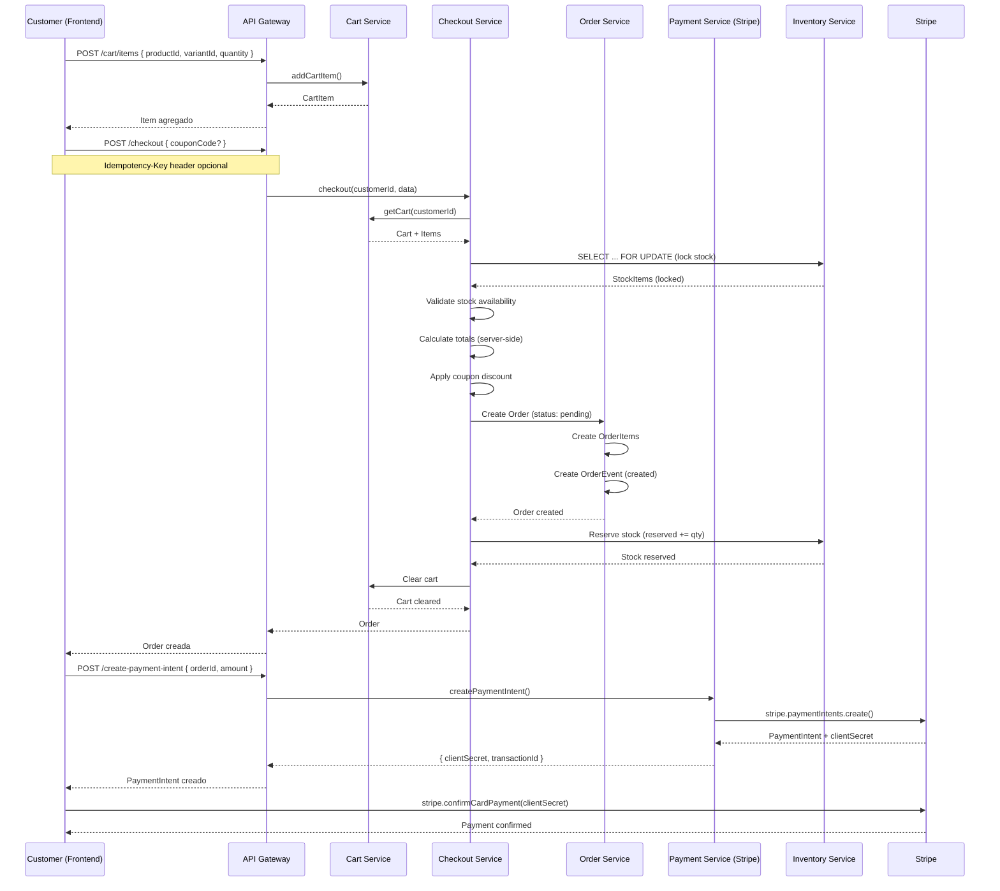
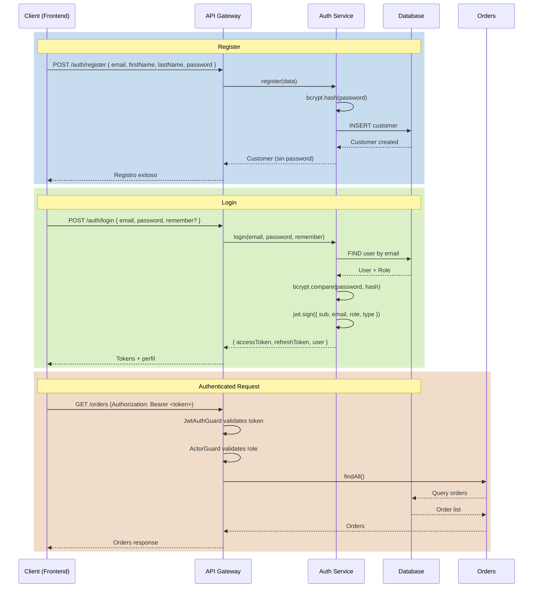
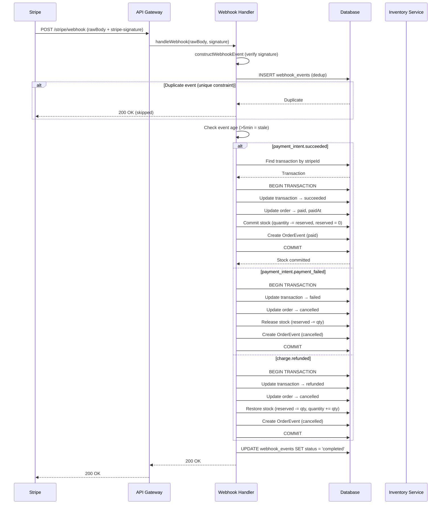

# IRC-01: Event Flow Diagrams

## 1. Checkout Flow

```mermaid
sequenceDiagram
    participant C as Customer (Frontend)
    participant API as API Gateway
    participant Cart as Cart Service
    participant Checkout as Checkout Service
    participant Order as Order Service
    participant Payment as Payment Service (Stripe)
    participant Stock as Inventory Service

    C->>API: POST /cart/items { productId, variantId, quantity }
    API->>Cart: addCartItem()
    Cart-->>API: CartItem
    API-->>C: Item agregado

    C->>API: POST /checkout { couponCode? }
    Note over C,API: Idempotency-Key header opcional
    API->>Checkout: checkout(customerId, data)

    Checkout->>Cart: getCart(customerId)
    Cart-->>Checkout: Cart + Items

    Checkout->>Stock: SELECT ... FOR UPDATE (lock stock)
    Stock-->>Checkout: StockItems (locked)

    Checkout->>Checkout: Validate stock availability
    Checkout->>Checkout: Calculate totals (server-side)
    Checkout->>Checkout: Apply coupon discount

    Checkout->>Order: Create Order (status: pending)
    Order->>Order: Create OrderItems
    Order->>Order: Create OrderEvent (created)
    Order-->>Checkout: Order created

    Checkout->>Stock: Reserve stock (reserved += qty)
    Stock-->>Checkout: Stock reserved

    Checkout->>Cart: Clear cart
    Cart-->>Checkout: Cart cleared

    Checkout-->>API: Order
    API-->>C: Order creada

    C->>API: POST /create-payment-intent { orderId, amount }
    API->>Payment: createPaymentIntent()
    Payment->>Stripe: stripe.paymentIntents.create()
    Stripe-->>Payment: PaymentIntent + clientSecret
    Payment-->>API: { clientSecret, transactionId }
    API-->>C: PaymentIntent creado

    C->>Stripe: stripe.confirmCardPayment(clientSecret)
    Stripe-->>C: Payment confirmed
```

## 2. Auth Flow (Login / Register)

```mermaid
sequenceDiagram
    participant C as Client (Frontend)
    participant API as API Gateway
    participant Auth as Auth Service
    participant DB as Database

    rect rgb(200, 220, 240)
        Note over C,DB: Register
        C->>API: POST /auth/register { email, firstName, lastName, password }
        API->>Auth: register(data)
        Auth->>Auth: bcrypt.hash(password)
        Auth->>DB: INSERT customer
        DB-->>Auth: Customer created
        Auth-->>API: Customer (sin password)
        API-->>C: Registro exitoso
    end

    rect rgb(220, 240, 200)
        Note over C,DB: Login
        C->>API: POST /auth/login { email, password, remember? }
        API->>Auth: login(email, password, remember)
        Auth->>DB: FIND user by email
        DB-->>Auth: User + Role
        Auth->>Auth: bcrypt.compare(password, hash)
        Auth->>Auth: jwt.sign({ sub, email, role, type })
        Auth-->>API: { accessToken, refreshToken, user }
        API-->>C: Tokens + perfil
    end

    rect rgb(240, 220, 200)
        Note over C,DB: Authenticated Request
        C->>API: GET /orders (Authorization: Bearer <token>)
        API->>API: JwtAuthGuard validates token
        API->>API: ActorGuard validates role
        API->>Orders: findAll()
        Orders-->>DB: Query orders
        DB-->>Orders: Order list
        Orders-->>API: Orders
        API-->>C: Orders response
    end
```

## 3. Webhook Flow (Stripe → Order update → Stock commit)

```mermaid
sequenceDiagram
    participant Stripe as Stripe
    participant API as API Gateway
    participant Webhook as Webhook Handler
    participant DB as Database
    participant Stock as Inventory Service

    Stripe->>API: POST /stripe/webhook (rawBody + stripe-signature)

    API->>Webhook: handleWebhook(rawBody, signature)
    Webhook->>Webhook: constructWebhookEvent (verify signature)

    Webhook->>DB: INSERT webhook_events (dedup)
    alt Duplicate event (unique constraint)
        DB-->>Webhook: Duplicate
        Webhook-->>Stripe: 200 OK (skipped)
    end

    Webhook->>Webhook: Check event age (>5min = stale)

    alt payment_intent.succeeded
        Webhook->>DB: Find transaction by stripeId
        DB-->>Webhook: Transaction
        Webhook->>DB: BEGIN TRANSACTION
        Webhook->>DB: Update transaction → succeeded
        Webhook->>DB: Update order → paid, paidAt
        Webhook->>DB: Commit stock (quantity -= reserved, reserved = 0)
        Webhook->>DB: Create OrderEvent (paid)
        Webhook->>DB: COMMIT
        DB-->>Webhook: Stock committed

    else payment_intent.payment_failed
        Webhook->>DB: BEGIN TRANSACTION
        Webhook->>DB: Update transaction → failed
        Webhook->>DB: Update order → cancelled
        Webhook->>DB: Release stock (reserved -= qty)
        Webhook->>DB: Create OrderEvent (cancelled)
        Webhook->>DB: COMMIT

    else charge.refunded
        Webhook->>DB: BEGIN TRANSACTION
        Webhook->>DB: Update transaction → refunded
        Webhook->>DB: Update order → cancelled
        Webhook->>DB: Restore stock (reserved -= qty, quantity += qty)
        Webhook->>DB: Create OrderEvent (cancelled)
        Webhook->>DB: COMMIT
    end

    Webhook->>DB: UPDATE webhook_events SET status = 'completed'
    Webhook-->>API: 200 OK
    API-->>Stripe: 200 OK
```
