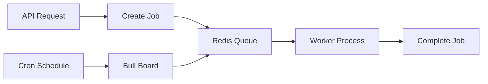

# IRC-01: Background Jobs Audit

## Current State

No hay un sistema formal de background jobs / colas implementado. Todas las operaciones se ejecutan de forma sincrona dentro del ciclo de vida de la request HTTP.

## Async Operations Identified

| Operacion | Actual | Ideal | Criticidad |
|-----------|--------|-------|------------|
| Liberacion de reservas expiradas | Endpoint manual `POST /reservations/release-expired` | Cron job (cada 5 min) | Alta |
| Envio de emails (confirmacion, recovery) | No implementado | Cola de eventos + mailer | Alta |
| Webhook processing | Sincrono en request | Cola para desacoplar | Media |
| Generacion de reports / export CSV | No implementado | Background job | Media |
| Sincronizacion de inventario | No implementado | Job programado | Media |
| Limpieza de sesiones expiradas | No implementado | Cron diario | Baja |
| Procesamiento de imagenes (thumbnails) | No implementado | Cola + sharp | Media |
| Notificaciones push / in-app | No implementado | Cola + WebSocket | Baja |

## Dependencies Available

- **`ioredis`** — Redis disponible para usar como broker de colas
- **Bull** — No instalado (recomendado: `npm install @nestjs/bull bull`)
- **`@nestjs/schedule`** — No instalado (recomendado para cron jobs simples)

## Recommended Architecture



## Recommendations for R7

1. **Instalar `@nestjs/bull` + `bull`** para manejo de colas con Redis
2. **Instalar `@nestjs/schedule`** para cron jobs simples
3. **Migrar `releaseExpiredReservations`** a cron job (cada 5 min)
4. **Implementar cola de emails** con plantillas y envio asyncrono
5. **Desacoplar webhooks** — recibir, validar, encolar, responder 200 inmediato
6. **Implementar cola de procesamiento de imagenes** (redimension, thumbnails)
7. **Agregar Bull Board** para monitoreo de colas en desarrollo

## Critical Path

```mermaid
gantt
    title Background Jobs Implementation
    dateFormat  YYYY-MM-DD
    section Core
    Install Bull + Schedule      :a1, 3d
    Reservation cron job         :a2, 2d
    Email queue                  :a3, 5d
    section Enhancement
    Webhook desacopling          :b1, 3d
    Image processing queue       :b2, 4d
    Monitoring (Bull Board)      :b3, 1d
```
