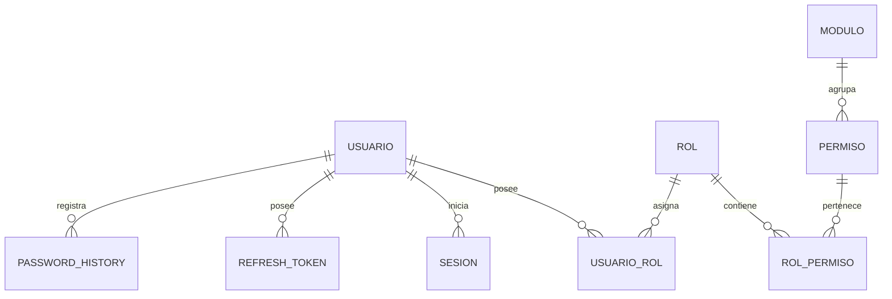

# PostgreSQL Physical Data Model

# Parte II

# IAM (Identity & Access Management)

> Proyecto: Alpacart ERP

---

# 1. Objetivo

El dominio IAM es responsable de la autenticación, autorización y administración de acceso al ERP.

Todos los usuarios internos deberán pertenecer a este dominio.

Los clientes del ecommerce NO pertenecen a IAM.

Los clientes pertenecen al dominio CRM.

---

# 2. Responsabilidades

IAM administra:

- Usuarios internos
- Roles
- Permisos
- Módulos
- Sesiones
- Tokens
- Auditoría de acceso

IAM NO administra:

- Clientes
- Pedidos
- Productos

---

# 3. Arquitectura

```text
IAM

├── Usuario
├── Rol
├── Permiso
├── Modulo
├── RolPermiso
├── UsuarioRol
├── Sesion
├── RefreshToken
└── PasswordHistory
```

---

# 4. Tabla Usuario

Nombre físico

usuario

---

Descripción

Representa una persona autorizada para ingresar al ERP.

---

Campos

| Campo | Tipo |
|--------|------|
| id | UUID |
| nombre | VARCHAR(120) |
| apellido | VARCHAR(120) |
| correo | VARCHAR(255) UNIQUE |
| telefono | VARCHAR(30) |
| password_hash | TEXT |
| avatar_url | TEXT |
| activo | BOOLEAN |
| ultimo_login | TIMESTAMPTZ |
| created_at | TIMESTAMPTZ |
| updated_at | TIMESTAMPTZ |
| deleted_at | TIMESTAMPTZ |

---

Índices

correo

activo

ultimo_login

---

Restricciones

Correo único.

Password obligatorio.

No eliminar físicamente.

---

# 5. Tabla Rol

Nombre físico

rol

---

Campos

id

nombre

descripcion

activo

created_at

updated_at

---

Ejemplos

Administrador

Gerencia

Ventas

Marketing

Logística

Almacén

Editor CMS

Atención Cliente

Contabilidad

---

# 6. Tabla Permiso

Representa una acción.

Ejemplos

producto.crear

producto.editar

producto.eliminar

producto.publicar

pedido.aprobar

pedido.cancelar

usuario.crear

usuario.editar

dashboard.ver

---

Campos

id

codigo

nombre

descripcion

modulo_id

activo

---

Índices

codigo UNIQUE

modulo_id

---

# 7. Tabla Modulo

Representa un módulo funcional.

Ejemplos

Dashboard

CRM

Catálogo

Inventario

Ventas

Marketing

CMS

Configuración

---

Campos

id

nombre

codigo

icono

ruta

orden

activo

---

# 8. Tabla RolPermiso

Tabla puente.

Campos

rol_id

permiso_id

created_at

---

PK

rol_id

permiso_id

---

# 9. Tabla UsuarioRol

Permite múltiples roles por usuario.

Campos

usuario_id

rol_id

principal

created_at

---

# 10. Tabla Sesion

Representa una sesión iniciada.

Campos

id

usuario_id

ip

user_agent

pais

ciudad

dispositivo

navegador

fecha_login

fecha_logout

expira_en

activa

---

# 11. Refresh Token

Campos

id

usuario_id

token_hash

expira_en

revocado

created_at

---

Nunca almacenar el token en texto plano.

Siempre hash.

---

# 12. Password History

Campos

id

usuario_id

password_hash

created_at

---

Propósito

Evitar reutilización de contraseñas.

---

# 13. Relaciones



---

# 14. Eventos

Produce

UsuarioCreado

UsuarioActualizado

UsuarioBloqueado

UsuarioEliminado

RolAsignado

RolRevocado

LoginExitoso

LoginFallido

Logout

PasswordActualizado

---

# 15. Seguridad

Contraseñas

Argon2id

JWT

Access Token

15 minutos

Refresh Token

30 días

MFA

Preparado

OAuth

Preparado

Google

Preparado

Microsoft

Preparado

---

# 16. Auditoría

Todas las operaciones generan auditoría.

LOGIN

LOGOUT

CREATE

UPDATE

DELETE

EXPORT

IMPORT

---

# 17. Futuras Expansiones

- MFA
- Passkeys
- SSO
- LDAP
- Azure AD
- Google Workspace
- GitHub Login
- Biometría