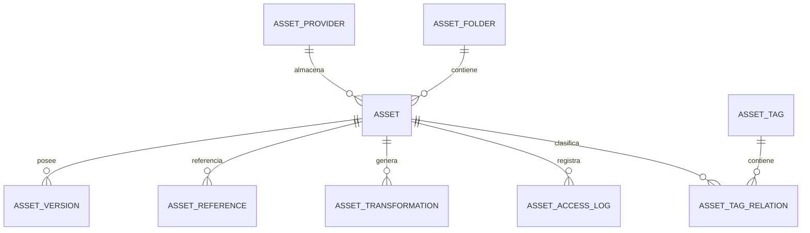

# PostgreSQL Physical Data Model

# Parte III

# Storage Service (Digital Asset Management - DAM)

> Proyecto: Alpacart ERP

---

# 1. Objetivo

El dominio Storage es responsable de administrar todos los archivos digitales utilizados por el ERP.

Este dominio desacopla completamente el almacenamiento físico del resto del sistema.

Los demás dominios nunca conocerán dónde se almacenan los archivos.

Solo conocerán el Asset.

---

# 2. Responsabilidades

Storage administra:

- Imágenes
- Videos
- Documentos
- Logos
- PDFs
- Banners
- Archivos CMS
- Archivos Marketing
- Facturas
- Certificados
- Archivos temporales

No administra:

- Productos
- Clientes
- Pedidos

Solo administra activos digitales.

---

# 3. Arquitectura

```text
STORAGE

├── Asset
├── AssetVersion
├── AssetFolder
├── AssetReference
├── AssetTag
├── AssetTagRelation
├── AssetTransformation
├── AssetAccessLog
├── AssetProvider
└── UploadSession
```

---

# 4. Concepto

Todos los archivos del sistema serán tratados como Assets.

Ejemplo

Producto

↓

Imagen

↓

Asset

CMS

↓

Banner

↓

Asset

Usuario

↓

Avatar

↓

Asset

Factura

↓

PDF

↓

Asset

Lookbook

↓

Fotografía

↓

Asset

Nunca guardar URLs directamente en los módulos.

Siempre guardar asset_id.

---

# 5. Tabla Asset

Nombre físico

asset

Descripción

Representa un archivo almacenado.

---

Campos

| Campo | Tipo |
|--------|------|
| id | UUID |
| nombre_original | VARCHAR(255) |
| nombre_interno | VARCHAR(255) |
| storage_key | TEXT |
| provider_id | UUID |
| mime_type | VARCHAR(120) |
| extension | VARCHAR(20) |
| tamaño_bytes | BIGINT |
| checksum_sha256 | VARCHAR(64) |
| ancho | INTEGER NULL |
| alto | INTEGER NULL |
| duracion | INTEGER NULL |
| estado | VARCHAR(30) |
| publico | BOOLEAN |
| carpeta_id | UUID NULL |
| created_at | TIMESTAMPTZ |
| updated_at | TIMESTAMPTZ |
| deleted_at | TIMESTAMPTZ |

---

Índices

storage_key UNIQUE

checksum_sha256

mime_type

provider_id

---

Restricciones

Nunca eliminar físicamente.

El checksum debe ser único cuando se configure deduplicación.

---

# 6. AssetVersion

Permite versionar archivos.

Ejemplo

Banner Home

↓

v1

↓

v2

↓

v3

---

Campos

id

asset_id

version

storage_key

checksum

created_at

created_by

---

Reglas

Siempre conservar historial.

Nunca sobrescribir archivos.

---

# 7. AssetFolder

Representa carpetas virtuales.

No depende del proveedor físico.

Ejemplo

Productos

CMS

Marketing

Usuarios

Facturas

Lookbook

Promociones

Pedidos

Certificados

---

Campos

id

nombre

slug

parent_id

orden

activo

---

Permite estructura jerárquica.

---

# 8. AssetReference

Esta es probablemente la tabla más importante.

Relaciona Assets con cualquier entidad.

Ejemplo

Producto

↓

Asset

CMS

↓

Asset

Usuario

↓

Asset

---

Campos

id

asset_id

entity_type

entity_id

usage

orden

principal

created_at

---

Ejemplo

entity_type

PRODUCT

entity_id

UUID

usage

THUMBNAIL

---

Otro ejemplo

entity_type

CMS_PAGE

usage

HERO

---

Ventajas

No necesitamos agregar columnas imagen_id en todas las tablas.

El Storage queda completamente desacoplado.

---

# 9. AssetTag

Permite clasificar Assets.

Ejemplos

Invierno

Promoción

Banner

Producto

Lifestyle

Editorial

Video

Home

---

Campos

id

nombre

slug

color

---

# 10. AssetTagRelation

Tabla puente

Asset

↓

Tags

---

Campos

asset_id

tag_id

---

# 11. AssetTransformation

Representa versiones generadas automáticamente.

Ejemplo

Imagen Original

↓

Thumbnail

↓

Medium

↓

Large

↓

WebP

↓

AVIF

↓

Mobile

↓

Desktop

---

Campos

id

asset_id

tipo

storage_key

ancho

alto

peso

formato

created_at

---

Preparado para procesamiento automático.

---

# 12. AssetAccessLog

Permite auditoría.

Campos

id

asset_id

usuario_id

accion

ip

created_at

---

Acciones

VIEW

DOWNLOAD

UPLOAD

DELETE

UPDATE

---

# 13. AssetProvider

Representa el proveedor físico.

Ejemplos

Local

Amazon S3

Cloudinary

MinIO

Azure Blob

Google Cloud Storage

---

Campos

id

nombre

codigo

activo

configuracion_json

---

Ventaja

Podemos cambiar de proveedor sin modificar el resto del ERP.

---

# 14. UploadSession

Permite cargas grandes.

Ejemplo

Video

↓

Chunk 1

↓

Chunk 2

↓

Chunk 3

↓

Finalizar

---

Campos

id

usuario_id

estado

bytes_recibidos

bytes_totales

created_at

expira_en

---

Preparado para cargas resumibles.

---

# 15. Relaciones



---

# 16. Eventos

Produce

AssetUploaded

AssetUpdated

AssetDeleted

AssetRestored

AssetReferenced

AssetTransformed

AssetDownloaded

ThumbnailGenerated

WebPGenerated

AVIFGenerated

---

# 17. Seguridad

Validar MIME Type.

Validar extensión.

Validar checksum.

Escaneo antivirus (futuro).

Límite de tamaño configurable.

Permisos por carpeta.

URLs firmadas para archivos privados.

---

# 18. Preparado para IA

El módulo soportará futuras integraciones:

- Etiquetado automático de imágenes.
- Detección de objetos.
- Eliminación de duplicados.
- Búsqueda por imagen.
- OCR.
- Generación automática de alt text.
- Optimización automática.
- Compresión inteligente.

---

# 19. Convenciones

Nunca guardar URLs en módulos de negocio.

Siempre guardar asset_id.

Los módulos de negocio solo conocerán referencias.

Storage decidirá cómo entregar el archivo.

---

# 20. Próximo Documento

El siguiente documento corresponde al dominio **CFG (Configuration Service)**, que administrará toda la configuración empresarial del ERP:

- Empresa
- Parámetros globales
- Monedas
- Idiomas
- Impuestos
- Integraciones
- Correos
- Redes sociales
- Configuración del e-commerce
- Configuración del CMS
- Configuración del sistema