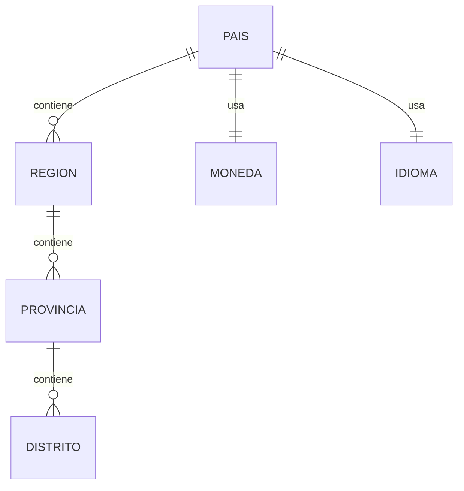

# PostgreSQL Physical Data Model

# Parte IV

# Master Data Management (MDM)

> Proyecto: Alpacart ERP

---

# 1. Objetivo

El dominio MDM (Master Data Management) centraliza toda la información maestra reutilizada por múltiples dominios del ERP.

Su propósito es evitar duplicidad de datos, garantizar consistencia y permitir la parametrización del sistema sin modificar código.

El MDM nunca almacena información transaccional.

Solo almacena información de referencia empresarial.

---

# 2. Responsabilidades

MDM administra:

- Países
- Departamentos
- Provincias
- Distritos
- Monedas
- Idiomas
- Impuestos
- Tipos de Documento
- Tipos de Persona
- Unidades de Medida
- Colores Base
- Métodos de Envío
- Métodos de Pago
- Estados Parametrizables
- Tipos de Movimiento
- Marcas
- Temporadas
- Etiquetas Globales

---

# 3. Arquitectura

```text
MDM

├── País
├── Región
├── Provincia
├── Distrito
├── Moneda
├── Idioma
├── Impuesto
├── UnidadMedida
├── TipoDocumento
├── TipoPersona
├── EstadoGeneral
├── MetodoEnvio
├── MetodoPago
├── ColorBase
├── Marca
├── Temporada
├── EtiquetaGlobal
└── ParametroGeneral
```

---

# 4. Tabla Pais

Nombre físico

pais

---

Descripción

Representa un país soportado por el ERP.

---

Campos

| Campo | Tipo |
|--------|------|
| id | UUID |
| codigo_iso2 | VARCHAR(2) |
| codigo_iso3 | VARCHAR(3) |
| nombre | VARCHAR(120) |
| gentilicio | VARCHAR(120) |
| moneda_principal_id | UUID |
| idioma_principal_id | UUID |
| activo | BOOLEAN |
| created_at | TIMESTAMPTZ |
| updated_at | TIMESTAMPTZ |

---

Índices

codigo_iso2 UNIQUE

codigo_iso3 UNIQUE

nombre

---

# 5. Tabla Región

Representa departamentos o estados.

Ejemplo

Lima

Junín

Cusco

---

Campos

id

pais_id

nombre

codigo

activo

---

# 6. Tabla Provincia

Campos

id

region_id

nombre

codigo

---

# 7. Tabla Distrito

Campos

id

provincia_id

nombre

codigo_postal

---

Jerarquía

```text
País

↓

Región

↓

Provincia

↓

Distrito
```

---

# 8. Tabla Moneda

Campos

id

codigo_iso

simbolo

nombre

decimales

activo

---

Ejemplos

PEN

USD

EUR

---

Preparado para futuras tasas de cambio.

---

# 9. Tabla Idioma

Campos

id

codigo

nombre

locale

activo

---

Ejemplos

es-PE

en-US

pt-BR

---

# 10. Tabla TipoDocumento

Ejemplos

DNI

RUC

Pasaporte

Carné de Extranjería

---

Campos

id

codigo

nombre

longitud

regex_validacion

activo

---

Preparado para validaciones nacionales.

---

# 11. Tabla UnidadMedida

Ejemplos

Unidad

Par

Kilogramo

Gramo

Metro

Centímetro

---

Campos

id

codigo

nombre

abreviatura

---

# 12. Tabla ColorBase

Esta tabla NO representa colores del catálogo.

Representa colores oficiales reutilizables.

Ejemplos

Negro

Blanco

Azul

Rojo

Gris

Beige

---

Campos

id

nombre

codigo_hex

activo

---

# 13. Tabla Marca

Preparada para crecimiento futuro.

Actualmente

Alpacart

Pero permitirá:

Alpacart Premium

Colecciones privadas

Nuevas líneas de negocio

---

# 14. Tabla Temporada

Ejemplos

Primavera 2026

Verano 2027

Invierno Heritage

Colección Navidad

---

Campos

id

nombre

fecha_inicio

fecha_fin

activa

---

# 15. Tabla MétodoPago

Ejemplos

Stripe

Visa

Mastercard

Yape

Plin

PayPal

Transferencia

---

# 16. Tabla MétodoEnvío

Ejemplos

Olva Courier

Shalom

Recojo en tienda

Delivery Local

DHL

FedEx

---

# 17. Tabla Impuesto

Campos

id

nombre

porcentaje

codigo

activo

---

Ejemplo

IGV

18%

---

# 18. Tabla ParametroGeneral

Configuraciones reutilizables.

Ejemplos

Moneda por defecto

Idioma

Zona Horaria

Formato Fecha

Formato Hora

Tamaño máximo de archivo

Longitud mínima contraseña

---

# 19. Relaciones



---

# 20. Consumo por Dominios

CRM

- País
- Distrito
- Documento

CAT

- Marca
- Temporada
- Color

TXT

- Unidad de Medida

INV

- Unidad
- Tipo Movimiento

OMS

- Método Pago
- Método Envío
- Impuesto

CMS

- Idioma

CFG

- Parámetros

---

# 21. Reglas

Nunca modificar códigos ISO.

No eliminar registros maestros.

Solo desactivar.

Toda modificación genera auditoría.

Toda tabla maestra tendrá cache.

---

# 22. Preparado para Multiempresa

Cada empresa podrá:

- Elegir su moneda.
- Elegir idioma.
- Configurar impuestos.
- Configurar métodos de envío.
- Configurar métodos de pago.

Sin modificar el código del ERP.

---

# 23. Futuras Expansiones

- Multi País.
- Multi Moneda.
- Multi Idioma.
- Multi Empresa.
- Localización tributaria.
- Integración con SUNAT.
- Integración con servicios gubernamentales.
- Catálogos parametrizables.

---

# 24. Próximo Documento

El siguiente documento corresponde al dominio CFG (Configuration Service), encargado de administrar la configuración empresarial específica de cada instancia del ERP, incluyendo empresa, sucursales, branding, correo, integraciones, API Keys, Webhooks, notificaciones y parámetros operativos.