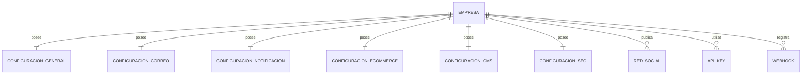

# PostgreSQL Physical Data Model

# Parte V

# Configuration Service (CFG)

> Proyecto: Alpacart ERP

---

# 1. Objetivo

El dominio Configuration Service (CFG) centraliza toda la configuración operativa del ERP.

Su propósito es permitir administrar parámetros empresariales desde el sistema, evitando configuraciones distribuidas en código fuente.

Este dominio contiene únicamente configuraciones globales del sistema.

No administra información transaccional.

---

# 2. Responsabilidades

CFG administra:

- Información de la empresa
- Configuración general
- Configuración del e-commerce
- Configuración del CMS
- Configuración de correos
- Configuración de impuestos
- Configuración de monedas
- Configuración de notificaciones
- API Keys
- Webhooks
- Redes Sociales

---

# 3. Arquitectura

CFG

├── Empresa
├── ConfiguracionGeneral
├── ConfiguracionCorreo
├── ConfiguracionNotificacion
├── ConfiguracionEcommerce
├── ConfiguracionCMS
├── ConfiguracionSEO
├── RedSocial
├── APIKey
├── Webhook
└── ParametroSistema

---

# 4. Tabla Empresa

Nombre físico

empresa

Descripción

Representa la información oficial de la empresa propietaria del ERP.

Campos

| Campo | Tipo |
|--------|------|
| id | UUID |
| razon_social | VARCHAR(200) |
| nombre_comercial | VARCHAR(200) |
| ruc | VARCHAR(20) |
| telefono | VARCHAR(40) |
| correo | VARCHAR(255) |
| sitio_web | TEXT |
| direccion | TEXT |
| logo_asset_id | UUID |
| favicon_asset_id | UUID |
| activo | BOOLEAN |
| created_at | TIMESTAMPTZ |
| updated_at | TIMESTAMPTZ |

Restricciones

Solo existirá un registro activo.

---

# 5. Tabla ConfiguracionGeneral

Descripción

Contiene parámetros generales del sistema.

Campos

id

empresa_id

timezone

locale

moneda_id

idioma_id

formato_fecha

formato_hora

inicio_semana

activo

---

# 6. Tabla ConfiguracionCorreo

Descripción

Configuración para el envío de correos electrónicos.

Campos

id

empresa_id

nombre_remitente

correo_remitente

proveedor

host

puerto

usuario

password_encriptado

tls

ssl

activo

---

# 7. Tabla ConfiguracionNotificacion

Descripción

Define el comportamiento de las notificaciones del sistema.

Campos

id

empresa_id

correo_habilitado

sms_habilitado

whatsapp_habilitado

push_habilitado

activo

---

# 8. Tabla ConfiguracionEcommerce

Descripción

Configuración específica de la tienda.

Campos

id

empresa_id

stock_visible

permitir_sin_stock

permitir_favoritos

permitir_resenas

permitir_cupones

dias_devolucion

productos_por_pagina

activo

---

# 9. Tabla ConfiguracionCMS

Descripción

Controla el comportamiento del sitio institucional.

Campos

id

empresa_id

tema

logo_principal_asset_id

banner_principal_asset_id

mostrar_blog

mostrar_promociones

mostrar_testimonios

activo

---

# 10. Tabla ConfiguracionSEO

Descripción

Configuración SEO global.

Campos

id

empresa_id

meta_title

meta_description

keywords

canonical_url

og_image_asset_id

robots_txt

google_analytics_id

google_tag_manager_id

facebook_pixel_id

---

# 11. Tabla RedSocial

Descripción

Redes sociales oficiales de la empresa.

Campos

id

empresa_id

nombre

url

icono

orden

activo

Ejemplos

Facebook

Instagram

TikTok

WhatsApp

LinkedIn

YouTube

Pinterest

---

# 12. Tabla APIKey

Descripción

Credenciales para integraciones externas.

Campos

id

empresa_id

nombre

servicio

api_key_encriptada

estado

fecha_expiracion

created_at

---

Ejemplos

Stripe

Cloudinary

Google Maps

SMTP

---

# 13. Tabla Webhook

Descripción

Eventos enviados hacia sistemas externos.

Campos

id

empresa_id

nombre

evento

url_destino

metodo_http

activo

ultimo_envio

---

# 14. Tabla ParametroSistema

Descripción

Parámetros configurables sin modificar código.

Campos

id

categoria

codigo

valor

tipo

descripcion

editable

activo

Ejemplos

MAX_UPLOAD_SIZE

PASSWORD_MIN_LENGTH

MAX_LOGIN_ATTEMPTS

ORDER_EXPIRATION_MINUTES

LOW_STOCK_ALERT

SESSION_TIMEOUT

---

# 15. Relaciones

---

# 16. Reglas de Negocio

- Solo puede existir una Empresa activa.
- Toda configuración pertenece a la Empresa.
- Las API Keys deben almacenarse cifradas.
- Los Webhooks deben registrar el último intento de envío.
- Los parámetros del sistema nunca deben modificarse directamente desde la base de datos.

---

# 17. Auditoría

Toda modificación deberá registrar:

- Usuario
- Fecha
- Valor anterior
- Valor nuevo
- Módulo
- Acción realizada

---

# 18. Dependencias

Este dominio será consumido por:

- IAM
- CRM
- CAT
- TXT
- INV
- OMS
- PAY
- SHP
- CMS
- MKT
- ANA

---

# 19. Próximo Documento

La siguiente parte corresponde al dominio AUD (Audit Service), responsable de registrar todos los eventos críticos del ERP, proporcionando trazabilidad completa de las operaciones realizadas por los usuarios y el sistema.