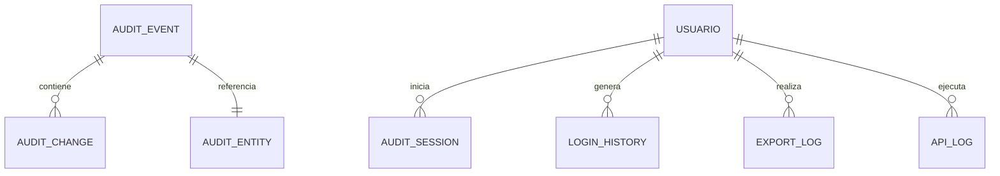

# PostgreSQL Physical Data Model

# Parte VI

# Audit Service (AUD)

> Proyecto: Alpacart ERP

---

# 1. Objetivo

El dominio AUD (Audit Service) es responsable de registrar todos los eventos importantes ocurridos dentro del ERP.

Su propósito es proporcionar trazabilidad completa de todas las acciones realizadas por usuarios y procesos internos.

El sistema nunca deberá perder información de auditoría.

Este módulo será utilizado por todos los demás dominios.

---

# 2. Responsabilidades

AUD administra:

- Eventos
- Cambios
- Acciones
- Historial
- Logs
- Exportaciones
- Importaciones
- Accesos
- Seguridad

No administra procesos del negocio.

Solo registra evidencia.

---

# 3. Arquitectura

AUD

├── AuditEvent
├── AuditChange
├── AuditEntity
├── AuditSession
├── LoginHistory
├── SystemLog
├── ApiLog
├── JobLog
├── NotificationLog
└── ExportLog

---

# 4. Filosofía

Toda acción importante genera un evento.

Nunca modificar registros históricos.

Nunca eliminar auditoría.

Toda auditoría será inmutable.

---

# 5. Tabla AuditEvent

Nombre físico

audit_event

Descripción

Representa un evento importante del sistema.

Campos

| Campo | Tipo |
|--------|------|
| id | UUID |
| event_code | VARCHAR(120) |
| event_name | VARCHAR(255) |
| module | VARCHAR(80) |
| entity_type | VARCHAR(80) |
| entity_id | UUID |
| action | VARCHAR(50) |
| severity | VARCHAR(20) |
| user_id | UUID NULL |
| session_id | UUID NULL |
| ip_address | VARCHAR(80) |
| user_agent | TEXT |
| occurred_at | TIMESTAMPTZ |

---

Ejemplos

PRODUCT_CREATED

ORDER_PAID

LOGIN_SUCCESS

PASSWORD_CHANGED

BANNER_UPDATED

---

# 6. Tabla AuditChange

Descripción

Registra cambios realizados sobre una entidad.

Campos

id

audit_event_id

field_name

old_value

new_value

created_at

---

Ejemplo

precio

120

135

---

# 7. Tabla AuditEntity

Descripción

Permite identificar entidades auditadas.

Campos

id

entity_type

entity_id

display_name

created_at

---

Ejemplo

PRODUCTO

UUID

Cardigan Heritage

---

# 8. Tabla AuditSession

Descripción

Representa una sesión auditada.

Campos

id

usuario_id

login_at

logout_at

ip

device

browser

country

city

successful

---

# 9. Tabla LoginHistory

Especializada en accesos.

Campos

id

usuario_id

fecha

resultado

motivo

ip

user_agent

---

Resultados

SUCCESS

FAILED

BLOCKED

MFA_REQUIRED

PASSWORD_EXPIRED

---

# 10. Tabla SystemLog

Eventos internos.

Campos

id

level

source

message

stack_trace

metadata_json

created_at

---

Niveles

INFO

WARNING

ERROR

CRITICAL

---

# 11. Tabla ApiLog

Registra llamadas API.

Campos

id

endpoint

method

status_code

duration_ms

request_size

response_size

user_id

created_at

---

# 12. Tabla JobLog

Procesos automáticos.

Campos

id

job_name

status

started_at

finished_at

duration_ms

error_message

---

# 13. Tabla NotificationLog

Correo

SMS

Push

WhatsApp

---

Campos

id

channel

recipient

status

provider

reference

created_at

---

# 14. Tabla ExportLog

Registra exportaciones.

Campos

id

usuario_id

module

file_name

format

records

created_at

---

Ejemplos

PDF

Excel

CSV

JSON

---

# 15. Relaciones

---

# 16. Severidad

DEBUG

INFO

WARNING

ERROR

CRITICAL

---

# 17. Acciones Auditables

LOGIN

LOGOUT

CREATE

UPDATE

DELETE

EXPORT

IMPORT

UPLOAD

DOWNLOAD

PAYMENT

REFUND

PUBLISH

UNPUBLISH

APPROVE

REJECT

---

# 18. Retención

AuditEvent

10 años

LoginHistory

5 años

ApiLog

1 año

SystemLog

1 año

NotificationLog

2 años

ExportLog

5 años

---

# 19. Reglas

Nunca modificar eventos.

Nunca eliminar auditoría.

Toda modificación importante debe producir AuditEvent.

Todo cambio debe almacenar usuario responsable.

---

# 20. Dependencias

Consumido por

IAM

CRM

CAT

TXT

INV

OMS

PAY

SHP

CMS

MKT

ANA

CFG

Storage

---

# 21. Próximo Documento

El siguiente documento corresponde al dominio CRM (Customer Relationship Management), donde se definirán todas las entidades relacionadas con clientes, perfiles, direcciones, favoritos, historial, soporte y segmentación.