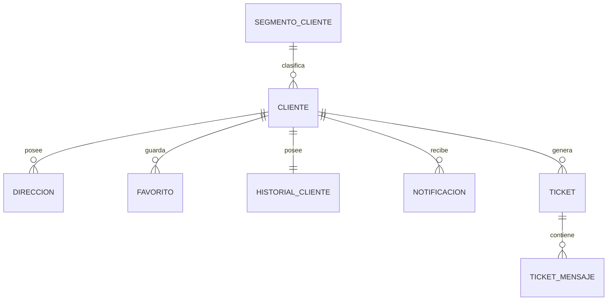

# PostgreSQL Physical Data Model

# Parte VII

# Customer Relationship Management (CRM)

> Proyecto: Alpacart ERP

---

# 1. Objetivo

El dominio CRM (Customer Relationship Management) administra toda la información relacionada con los clientes del e-commerce.

Este dominio centraliza el perfil del cliente, sus direcciones, historial comercial, listas de favoritos, notificaciones y solicitudes de soporte.

El CRM representa únicamente a los clientes del negocio.

No administra usuarios internos del ERP.

---

# 2. Responsabilidades

CRM administra:

- Clientes
- Direcciones
- Favoritos
- Historial
- Notificaciones
- Tickets de soporte
- Segmentación

No administra:

- Productos
- Inventario
- Pagos
- Usuarios internos

---

# 3. Arquitectura

CRM

├── Cliente
├── Direccion
├── Favorito
├── HistorialCliente
├── Notificacion
├── Ticket
├── TicketMensaje
└── SegmentoCliente

---

# 4. Flujo del Dominio

Visitante

↓

Registro

↓

Cliente

↓

Compra

↓

Historial

↓

Notificaciones

↓

Nueva Compra

↓

Fidelización

---

# 5. Entidades

- Cliente
- Dirección
- Favorito
- HistorialCliente
- Notificación
- Ticket
- TicketMensaje
- SegmentoCliente

---

# 6. Tabla Cliente

Nombre físico

cliente

Descripción

Representa a una persona registrada que realiza compras en la plataforma.

Campos

| Campo | Tipo |
|--------|------|
| id | UUID |
| nombres | VARCHAR(150) |
| apellidos | VARCHAR(150) |
| correo | VARCHAR(255) |
| telefono | VARCHAR(40) |
| tipo_documento_id | UUID |
| numero_documento | VARCHAR(30) |
| fecha_nacimiento | DATE NULL |
| genero | VARCHAR(20) NULL |
| activo | BOOLEAN |
| created_at | TIMESTAMPTZ |
| updated_at | TIMESTAMPTZ |
| deleted_at | TIMESTAMPTZ NULL |

Índices

correo UNIQUE

numero_documento

activo

Restricciones

Correo único.

No eliminar físicamente.

---

# 7. Tabla Direccion

Nombre físico

direccion

Descripción

Direcciones registradas por el cliente.

Campos

id

cliente_id

pais_id

region_id

provincia_id

distrito_id

direccion

referencia

codigo_postal

principal

activo

created_at

updated_at

Restricciones

Solo una dirección principal por cliente.

---

# 8. Tabla Favorito

Nombre físico

favorito

Descripción

Lista de productos favoritos.

Campos

id

cliente_id

producto_id

created_at

Restricciones

No repetir un mismo producto para un mismo cliente.

---

# 9. Tabla HistorialCliente

Nombre físico

historial_cliente

Descripción

Resumen de la actividad comercial del cliente.

Campos

id

cliente_id

ultima_compra

total_pedidos

monto_acumulado

ultima_visita

ultima_actualizacion

Observaciones

Los datos pueden actualizarse automáticamente tras cada pedido.

---

# 10. Tabla Notificacion

Nombre físico

notificacion

Descripción

Notificaciones enviadas al cliente.

Campos

id

cliente_id

titulo

mensaje

tipo

leida

fecha_lectura

created_at

Tipos

Promoción

Pedido

Sistema

Cuenta

---

# 11. Tabla Ticket

Nombre físico

ticket

Descripción

Solicitud de atención realizada por el cliente.

Campos

id

cliente_id

codigo

asunto

estado

prioridad

created_at

updated_at

Estados

Abierto

En proceso

Resuelto

Cerrado

---

# 12. Tabla TicketMensaje

Nombre físico

ticket_mensaje

Descripción

Mensajes intercambiados dentro de un ticket.

Campos

id

ticket_id

autor

mensaje

adjunto_asset_id

created_at

---

# 13. Tabla SegmentoCliente

Nombre físico

segmento_cliente

Descripción

Clasificación comercial del cliente.

Campos

id

nombre

descripcion

activo

Ejemplos

Nuevo

Frecuente

VIP

Mayorista

---

# 14. Relaciones

---

# 15. Índices

Cliente

correo

numero_documento

Direccion

cliente_id

principal

Favorito

cliente_id

producto_id

Ticket

codigo

estado

cliente_id

Notificacion

cliente_id

leida

---

# 16. Reglas de Negocio

- Un cliente puede tener múltiples direcciones.
- Solo una dirección puede marcarse como principal.
- Un cliente puede registrar múltiples favoritos.
- Un cliente solo puede guardar una vez el mismo producto.
- Todo ticket pertenece a un cliente.
- Todo mensaje pertenece a un ticket.
- Todo cliente pertenece a un segmento comercial.
- El historial comercial nunca debe eliminarse.

---

# 17. Eventos

Produce

ClienteRegistrado

ClienteActualizado

DireccionRegistrada

FavoritoAgregado

FavoritoEliminado

TicketCreado

TicketRespondido

NotificacionEnviada

SegmentoActualizado

---

# 18. Casos de Uso

CU-CRM-001 Registrar cliente

CU-CRM-002 Actualizar perfil

CU-CRM-003 Registrar dirección

CU-CRM-004 Administrar favoritos

CU-CRM-005 Consultar historial

CU-CRM-006 Crear ticket

CU-CRM-007 Responder ticket

CU-CRM-008 Consultar notificaciones

---

# 19. Validaciones

- Correo obligatorio.
- Correo único.
- Documento único.
- Dirección principal única.
- Ticket con código único.
- Producto favorito no duplicado.

---

# 20. Dependencias

Consume

MDM

Storage

CFG

Produce información para

OMS

Marketing

Analytics

---

# 21. Resumen del Dominio

Aggregate Root

Cliente

Entidades

8

Relaciones

7

Eventos

9

Casos de Uso

8

Dependencias

3