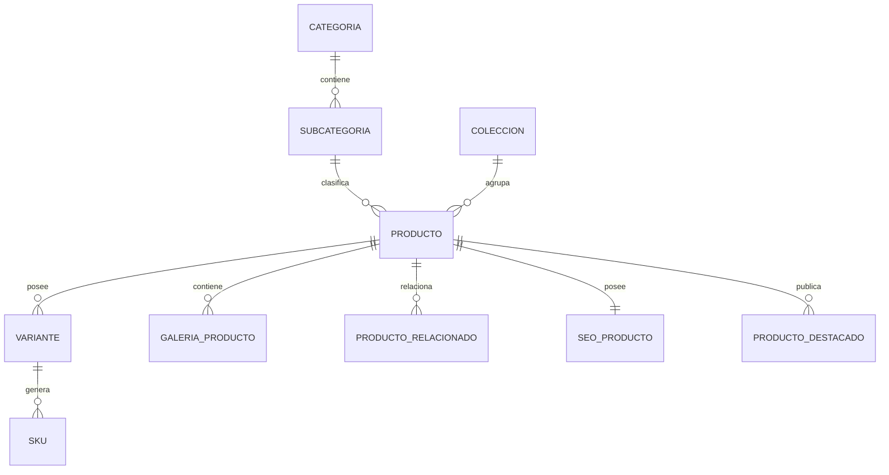

    # PostgreSQL Physical Data Model

# Parte VIII

# Catalog Service (CAT)

> Proyecto: Alpacart ERP

---

# 1. Objetivo

El dominio Catalog (CAT) administra toda la información comercial relacionada con los productos ofrecidos por la empresa.

Este dominio es responsable de definir qué productos existen, cómo se organizan, cómo se presentan al cliente y cómo se relacionan entre sí.

El dominio Catalog NO administra:

- Inventario
- Stock
- Movimientos
- Pagos
- Pedidos

El inventario será responsabilidad exclusiva del dominio Inventory.

---

# 2. Responsabilidades

Catalog administra:

- Productos
- Categorías
- Subcategorías
- Colecciones
- Temporadas
- Variantes
- SKU
- Galerías
- Etiquetas
- Productos relacionados
- Productos destacados
- SEO

---

# 3. Arquitectura

CAT

├── Categoria
├── Subcategoria
├── Coleccion
├── Producto
├── Variante
├── SKU
├── GaleriaProducto
├── ProductoRelacionado
├── ProductoDestacado
├── EtiquetaProducto
└── SEOProducto

---

# 4. Flujo del Dominio

Categoría

↓

Subcategoría

↓

Colección

↓

Producto

↓

Variante

↓

SKU

↓

Publicado

↓

Disponible para venta

---

# 5. Entidades

- Categoria
- Subcategoria
- Coleccion
- Producto
- Variante
- SKU
- GaleriaProducto
- ProductoRelacionado
- ProductoDestacado
- EtiquetaProducto
- SEOProducto

---

# 6. Tabla Categoria

Nombre físico

categoria

Descripción

Agrupa productos por tipo comercial.

Campos

| Campo | Tipo |
|--------|------|
| id | UUID |
| nombre | VARCHAR(120) |
| slug | VARCHAR(150) |
| descripcion | TEXT |
| icono_asset_id | UUID NULL |
| imagen_asset_id | UUID NULL |
| orden | INTEGER |
| activa | BOOLEAN |
| created_at | TIMESTAMPTZ |
| updated_at | TIMESTAMPTZ |
| deleted_at | TIMESTAMPTZ NULL |

Restricciones

Nombre único.

Slug único.

---

# 7. Tabla Subcategoria

Nombre físico

subcategoria

Campos

id

categoria_id

nombre

slug

descripcion

orden

activa

created_at

updated_at

Restricciones

Nombre único dentro de la categoría.

---

# 8. Tabla Coleccion

Nombre físico

coleccion

Descripción

Agrupa productos bajo una misma línea comercial.

Campos

id

nombre

slug

descripcion

temporada_id

banner_asset_id

fecha_inicio

fecha_fin

publicada

created_at

updated_at

Ejemplos

Heritage

Winter

Luxury

Premium

---

# 9. Tabla Producto

Nombre físico

producto

Descripción

Representa un producto comercial.

No contiene inventario.

No contiene stock.

Campos

id

categoria_id

subcategoria_id

coleccion_id

nombre

slug

descripcion_corta

descripcion_larga

estado

visible

precio_referencia

peso

unidad_medida_id

seo_id

created_at

updated_at

Estados

Borrador

Publicado

Archivado

Descontinuado

---

# 10. Tabla Variante

Nombre físico

variante

Descripción

Representa una combinación comercial antes de generar SKU.

Campos

id

producto_id

nombre

color_base_id

activo

created_at

updated_at

Ejemplo

Color Azul

Color Beige

Color Negro

---

# 11. Tabla SKU

Nombre físico

sku

Descripción

Unidad vendible.

Todo el inventario pertenece al SKU.

Campos

id

variante_id

codigo

codigo_barras

talla

precio

precio_oferta

costo

activo

created_at

updated_at

Restricciones

Código único.

Código de barras único.

---

# 12. Tabla GaleriaProducto

Nombre físico

galeria_producto

Descripción

Imágenes asociadas al producto.

Campos

id

producto_id

asset_id

orden

principal

texto_alternativo

created_at

Restricciones

Solo una imagen principal por producto.

---

# 13. Tabla ProductoRelacionado

Nombre físico

producto_relacionado

Descripción

Productos sugeridos durante la compra.

Campos

producto_id

producto_relacionado_id

created_at

Restricciones

No relacionar un producto consigo mismo.

---

# 14. Tabla ProductoDestacado

Nombre físico

producto_destacado

Descripción

Productos destacados del sitio.

Campos

id

producto_id

fecha_inicio

fecha_fin

orden

activo

---

# 15. Tabla EtiquetaProducto

Nombre físico

etiqueta_producto

Descripción

Etiquetas comerciales visibles.

Campos

id

nombre

color

activo

Ejemplos

Nuevo

Oferta

Exclusivo

Edición Limitada

Más Vendido

---

# 16. Tabla SEOProducto

Nombre físico

seo_producto

Descripción

Información SEO específica.

Campos

id

producto_id

meta_title

meta_description

keywords

canonical_url

robots

og_image_asset_id

---

# 17. Relaciones

---

# 18. Índices

Categoria

slug

nombre

Producto

slug

nombre

estado

categoria_id

coleccion_id

SKU

codigo

codigo_barras

activo

Galeria

producto_id

principal

---

# 19. Reglas de Negocio

- Todo Producto pertenece a una Categoría.
- Una Subcategoría pertenece únicamente a una Categoría.
- Todo Producto puede pertenecer a una Colección.
- Todo Producto debe tener al menos una Variante antes de publicarse.
- Todo SKU pertenece exactamente a una Variante.
- El Inventario siempre pertenece al SKU.
- Solo puede existir una imagen principal por producto.
- Un Producto no puede relacionarse consigo mismo.
- Un Producto publicado debe tener al menos un SKU activo.

---

# 20. Eventos

Produce

CategoriaCreada

CategoriaActualizada

ProductoCreado

ProductoPublicado

ProductoArchivado

VarianteCreada

SKUCreado

PrecioActualizado

ProductoDestacado

SEOActualizado

---

# 21. Casos de Uso

CU-CAT-001 Crear categoría

CU-CAT-002 Crear subcategoría

CU-CAT-003 Crear colección

CU-CAT-004 Registrar producto

CU-CAT-005 Crear variante

CU-CAT-006 Registrar SKU

CU-CAT-007 Administrar galería

CU-CAT-008 Configurar SEO

CU-CAT-009 Publicar producto

CU-CAT-010 Configurar productos relacionados

---

# 22. Validaciones

- Nombre de categoría obligatorio.
- Slug único.
- Código SKU único.
- Código de barras único.
- Precio mayor o igual a cero.
- Precio de oferta menor o igual al precio regular.
- El producto debe tener una categoría antes de publicarse.
- El producto debe tener al menos un SKU activo antes de estar disponible para la venta.

---

# 23. Dependencias

Consume

- MDM
- Storage
- CFG

Produce información para

- Inventory
- OMS
- CMS
- Marketing
- Analytics

---

# 24. Resumen del Dominio

Aggregate Root

Producto

Entidades

11

Relaciones

9

Eventos

10

Casos de Uso

10

Dependencias

3