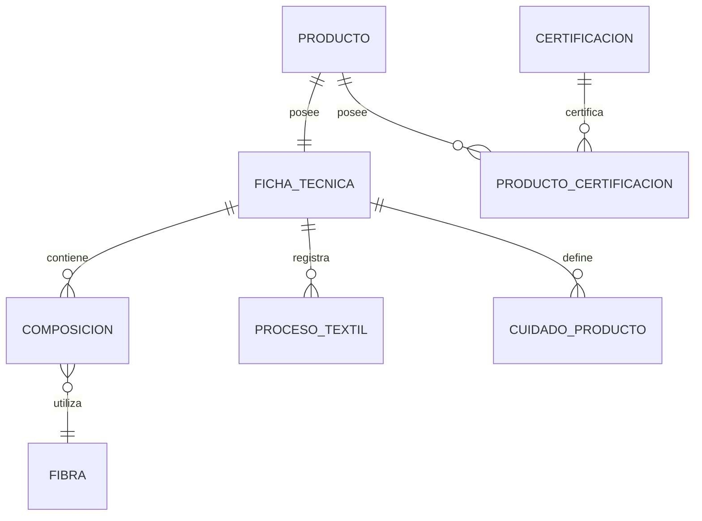

# PostgreSQL Physical Data Model

# Parte IX

# Textile Service (TXT)

> Proyecto: Alpacart ERP

---

# 1. Objetivo

El dominio Textile (TXT) administra toda la información técnica relacionada con la fabricación, composición y características textiles de los productos.

Este dominio separa completamente la información técnica del producto de la información comercial.

El objetivo es mantener un modelo limpio donde el catálogo describa cómo se vende el producto y Textile describa cómo está construido.

---

# 2. Responsabilidades

Textile administra:

- Fibras
- Composición
- Procesos
- Cuidados
- Certificaciones
- Ficha Técnica

No administra:

- Precio
- Inventario
- Pedidos
- Pagos
- Marketing

---

# 3. Arquitectura

TXT

├── Fibra
├── Composicion
├── FichaTecnica
├── ProcesoTextil
├── CuidadoProducto
├── Certificacion
└── ProductoCertificacion

---

# 4. Flujo del Dominio

Producto

↓

Ficha Técnica

↓

Composición

↓

Fibra

↓

Procesos

↓

Cuidados

↓

Certificaciones

---

# 5. Entidades

- Fibra
- Composicion
- FichaTecnica
- ProcesoTextil
- CuidadoProducto
- Certificacion
- ProductoCertificacion

---

# 6. Tabla Fibra

Nombre físico

fibra

Descripción

Representa una fibra textil utilizada para fabricar productos.

Campos

| Campo | Tipo |
|--------|------|
| id | UUID |
| nombre | VARCHAR(120) |
| descripcion | TEXT |
| origen | VARCHAR(150) |
| calidad | VARCHAR(100) |
| activo | BOOLEAN |
| created_at | TIMESTAMPTZ |
| updated_at | TIMESTAMPTZ |

Ejemplos

Baby Alpaca

Alpaca

Merino

Algodón

Lana

---

# 7. Tabla FichaTecnica

Nombre físico

ficha_tecnica

Descripción

Información técnica principal del producto.

Campos

id

producto_id

peso

unidad_medida_id

pais_origen_id

gramaje

descripcion_tecnica

created_at

updated_at

Restricciones

Una ficha técnica por producto.

---

# 8. Tabla Composicion

Nombre físico

composicion

Descripción

Define las fibras que conforman un producto.

Campos

id

ficha_tecnica_id

fibra_id

porcentaje

orden

created_at

Restricciones

El porcentaje debe estar entre 0 y 100.

La suma de porcentajes por ficha técnica debe ser exactamente 100%.

---

# 9. Tabla ProcesoTextil

Nombre físico

proceso_textil

Descripción

Procesos aplicados durante la fabricación.

Campos

id

ficha_tecnica_id

nombre

descripcion

orden

created_at

Ejemplos

Hilado

Tejido

Lavado

Acabado

Control de calidad

---

# 10. Tabla CuidadoProducto

Nombre físico

cuidado_producto

Descripción

Indicaciones de mantenimiento del producto.

Campos

id

ficha_tecnica_id

tipo

descripcion

icono_asset_id

orden

created_at

Ejemplos

Lavar a mano

No usar lejía

Secado horizontal

No usar secadora

Planchar a baja temperatura

---

# 11. Tabla Certificacion

Nombre físico

certificacion

Descripción

Certificaciones aplicables a productos textiles.

Campos

id

nombre

descripcion

entidad_emisora

activo

created_at

Ejemplos

Fibra Natural

Producción Artesanal

Comercio Justo

Origen Certificado

---

# 12. Tabla ProductoCertificacion

Nombre físico

producto_certificacion

Descripción

Relaciona productos con certificaciones.

Campos

producto_id

certificacion_id

fecha_certificacion

fecha_vencimiento

created_at

---

# 13. Relaciones

---

# 14. Índices

Fibra

nombre

FichaTecnica

producto_id UNIQUE

Composicion

ficha_tecnica_id

fibra_id

ProcesoTextil

ficha_tecnica_id

orden

CuidadoProducto

ficha_tecnica_id

orden

ProductoCertificacion

producto_id

certificacion_id

---

# 15. Reglas de Negocio

- Todo Producto puede tener únicamente una Ficha Técnica.
- Una Ficha Técnica puede tener múltiples componentes de composición.
- La suma de los porcentajes de composición debe ser exactamente 100%.
- Una Ficha Técnica puede registrar múltiples procesos textiles.
- Una Ficha Técnica puede registrar múltiples cuidados.
- Un Producto puede poseer múltiples certificaciones.
- Una Certificación puede aplicarse a múltiples productos.

---

# 16. Eventos

Produce

FichaTecnicaCreada

FichaTecnicaActualizada

FibraRegistrada

ComposicionActualizada

ProcesoTextilRegistrado

CuidadoActualizado

CertificacionAsignada

---

# 17. Casos de Uso

CU-TXT-001 Registrar fibra

CU-TXT-002 Crear ficha técnica

CU-TXT-003 Configurar composición

CU-TXT-004 Registrar proceso textil

CU-TXT-005 Registrar cuidados

CU-TXT-006 Asignar certificaciones

CU-TXT-007 Consultar ficha técnica

---

# 18. Validaciones

- Nombre de fibra obligatorio.
- Una ficha técnica por producto.
- Porcentaje entre 0 y 100.
- Composición total igual a 100%.
- Certificaciones activas únicamente.
- No duplicar una misma fibra dentro de la misma composición.

---

# 19. Dependencias

Consume

- Catalog
- MDM
- Storage

Produce información para

- CMS
- Marketing
- Analytics

---

# 20. Resumen del Dominio

Aggregate Root

FichaTecnica

Entidades

7

Relaciones

7

Eventos

7

Casos de Uso

7

Dependencias

3