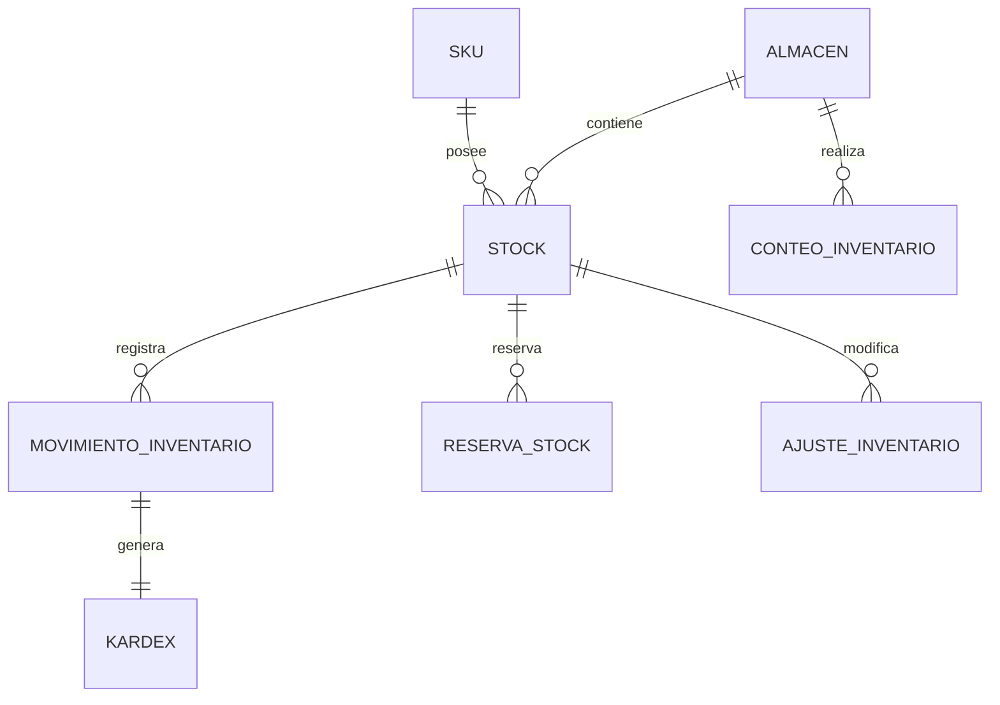

# PostgreSQL Physical Data Model

# Parte X

# Inventory Service (INV)

> Proyecto: Alpacart ERP

---

# 1. Objetivo

El dominio Inventory (INV) administra toda la información relacionada con el inventario físico de los productos comercializados por la empresa.

Este dominio es responsable del control de existencias, movimientos, reservas, ajustes y trazabilidad del inventario.

El inventario siempre pertenece al SKU.

Nunca al Producto.

---

# 2. Responsabilidades

Inventory administra:

- Almacenes
- Stock
- Movimientos
- Kardex
- Reservas
- Ajustes
- Conteos físicos

No administra:

- Productos
- Clientes
- Pedidos
- Pagos

---

# 3. Arquitectura

INV

├── Almacen
├── Stock
├── MovimientoInventario
├── Kardex
├── ReservaStock
├── AjusteInventario
└── ConteoInventario

---

# 4. Flujo del Dominio

Recepción

↓

Ingreso de Stock

↓

Disponible

↓

Reserva

↓

Salida

↓

Ajuste

↓

Kardex

---

# 5. Entidades

- Almacen
- Stock
- MovimientoInventario
- Kardex
- ReservaStock
- AjusteInventario
- ConteoInventario

---

# 6. Tabla Almacen

Nombre físico

almacen

Descripción

Representa una ubicación física donde se almacena inventario.

Campos

| Campo | Tipo |
|--------|------|
| id | UUID |
| nombre | VARCHAR(120) |
| codigo | VARCHAR(30) |
| direccion | TEXT |
| responsable | VARCHAR(150) |
| activo | BOOLEAN |
| created_at | TIMESTAMPTZ |
| updated_at | TIMESTAMPTZ |

Restricciones

Código único.

---

# 7. Tabla Stock

Nombre físico

stock

Descripción

Representa la existencia actual de un SKU en un almacén.

Campos

id

sku_id

almacen_id

cantidad_disponible

cantidad_reservada

cantidad_minima

cantidad_maxima

ultima_actualizacion

created_at

updated_at

Restricciones

Un solo registro por combinación SKU + Almacén.

---

# 8. Tabla MovimientoInventario

Nombre físico

movimiento_inventario

Descripción

Registra toda entrada o salida de inventario.

Campos

id

stock_id

tipo_movimiento_id

cantidad

stock_anterior

stock_resultante

referencia

observacion

usuario_id

created_at

Ejemplos de referencia

Compra

Venta

Ajuste

Devolución

Transferencia

---

# 9. Tabla Kardex

Nombre físico

kardex

Descripción

Historial cronológico de movimientos del inventario.

Campos

id

movimiento_id

fecha

tipo

entrada

salida

saldo

usuario_id

created_at

Observaciones

Nunca modificar registros existentes.

---

# 10. Tabla ReservaStock

Nombre físico

reserva_stock

Descripción

Cantidad reservada temporalmente para un pedido.

Campos

id

stock_id

pedido_id

cantidad

estado

fecha_expiracion

created_at

Estados

Activa

Liberada

Consumida

Expirada

---

# 11. Tabla AjusteInventario

Nombre físico

ajuste_inventario

Descripción

Correcciones manuales del inventario.

Campos

id

stock_id

cantidad_anterior

cantidad_nueva

motivo

autorizado_por

created_at

Motivos

Conteo físico

Producto dañado

Corrección

Pérdida

Ganancia

---

# 12. Tabla ConteoInventario

Nombre físico

conteo_inventario

Descripción

Resultado de un conteo físico.

Campos

id

almacen_id

fecha

estado

responsable

observaciones

created_at

Estados

Pendiente

En Proceso

Finalizado

Aprobado

---

# 13. Relaciones

---

# 14. Índices

Stock

sku_id

almacen_id

MovimientoInventario

stock_id

tipo_movimiento_id

created_at

ReservaStock

pedido_id

estado

fecha_expiracion

ConteoInventario

almacen_id

estado

---

# 15. Reglas de Negocio

- Todo Stock pertenece a un SKU.
- Todo Stock pertenece a un Almacén.
- No puede existir stock negativo.
- Toda modificación del stock debe generar un Movimiento.
- Todo Movimiento debe generar un registro Kardex.
- Toda Reserva debe tener fecha de expiración.
- Un Ajuste siempre requiere responsable.
- Un Conteo físico nunca modifica directamente el Stock; debe generar un Ajuste.

---

# 16. Eventos

Produce

StockCreado

StockActualizado

StockReservado

ReservaLiberada

MovimientoRegistrado

KardexGenerado

AjusteRegistrado

ConteoIniciado

ConteoFinalizado

---

# 17. Casos de Uso

CU-INV-001 Registrar almacén

CU-INV-002 Consultar stock

CU-INV-003 Registrar ingreso

CU-INV-004 Registrar salida

CU-INV-005 Reservar stock

CU-INV-006 Liberar reserva

CU-INV-007 Registrar ajuste

CU-INV-008 Consultar Kardex

CU-INV-009 Realizar conteo físico

---

# 18. Validaciones

- SKU obligatorio.
- Almacén obligatorio.
- Cantidad mayor o igual a cero.
- Reserva menor o igual al stock disponible.
- Ajuste con motivo obligatorio.
- Un único registro de Stock por SKU y Almacén.
- No permitir eliminar movimientos ni registros Kardex.

---

# 19. Dependencias

Consume

- Catalog (SKU)
- MDM
- IAM

Produce información para

- OMS
- Analytics

---

# 20. Resumen del Dominio

Aggregate Root

Stock

Entidades

7

Relaciones

7

Eventos

9

Casos de Uso

9

Dependencias

3