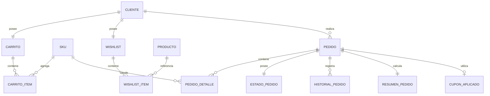

# PostgreSQL Physical Data Model

# Parte XI

# Order Management Service (OMS)

> Proyecto: Alpacart ERP

---

# 1. Objetivo

El dominio Order Management Service (OMS) administra todo el ciclo de vida de una compra realizada por un cliente.

Este dominio inicia cuando un cliente agrega productos al carrito y finaliza cuando el pedido ha sido entregado o cancelado.

OMS coordina la operación comercial entre los dominios CRM, Catalog, Inventory, Payments y Shipping.

OMS no procesa pagos.

OMS no administra inventario.

OMS únicamente orquesta el proceso de venta.

---

# 2. Responsabilidades

OMS administra:

- Carrito de compras
- Items del carrito
- Wishlist
- Pedidos
- Detalles del pedido
- Estados del pedido
- Historial del pedido
- Cupones aplicados
- Resumen de compra

No administra:

- Stock
- Pagos
- Envíos

---

# 3. Arquitectura

OMS

├── Carrito
├── CarritoItem
├── Wishlist
├── WishlistItem
├── Pedido
├── PedidoDetalle
├── EstadoPedido
├── HistorialPedido
├── CuponAplicado
└── ResumenPedido

---

# 4. Flujo del Dominio

Cliente

↓

Carrito

↓

Wishlist (Opcional)

↓

Checkout

↓

Pedido

↓

Pago

↓

Preparación

↓

Envío

↓

Entrega

↓

Cierre

---

# 5. Entidades

- Carrito
- CarritoItem
- Wishlist
- WishlistItem
- Pedido
- PedidoDetalle
- EstadoPedido
- HistorialPedido
- CuponAplicado
- ResumenPedido

---

# 6. Tabla Carrito

Nombre físico

carrito

Descripción

Representa el carrito activo del cliente.

Campos

| Campo | Tipo |
|--------|------|
| id | UUID |
| cliente_id | UUID |
| estado | VARCHAR(30) |
| created_at | TIMESTAMPTZ |
| updated_at | TIMESTAMPTZ |

Estados

Activo

Convertido

Abandonado

Expirado

---

# 7. Tabla CarritoItem

Nombre físico

carrito_item

Descripción

Productos agregados al carrito.

Campos

id

carrito_id

sku_id

cantidad

precio_unitario

subtotal

created_at

Restricciones

No duplicar el mismo SKU en un mismo carrito.

Actualizar cantidad.

---

# 8. Tabla Wishlist

Nombre físico

wishlist

Descripción

Lista de deseos del cliente.

Campos

id

cliente_id

created_at

updated_at

---

# 9. Tabla WishlistItem

Nombre físico

wishlist_item

Campos

id

wishlist_id

producto_id

created_at

Restricciones

No duplicar productos.

---

# 10. Tabla Pedido

Nombre físico

pedido

Descripción

Representa una compra confirmada.

Campos

id

cliente_id

codigo

estado_pedido_id

direccion_id

subtotal

descuento

impuestos

costo_envio

total

moneda_id

observaciones

created_at

updated_at

Restricciones

Código único.

Total mayor o igual a cero.

---

# 11. Tabla PedidoDetalle

Nombre físico

pedido_detalle

Descripción

Productos vendidos dentro del pedido.

Campos

id

pedido_id

sku_id

cantidad

precio_unitario

descuento

subtotal

created_at

Observaciones

El precio debe almacenarse al momento de la compra.

Nunca depender del precio actual del catálogo.

---

# 12. Tabla EstadoPedido

Nombre físico

estado_pedido

Descripción

Estado actual del pedido.

Campos

id

codigo

nombre

color

orden

activo

Ejemplos

Pendiente

Confirmado

Pagado

Preparación

Empacado

Enviado

Entregado

Cancelado

Devuelto

---

# 13. Tabla HistorialPedido

Nombre físico

historial_pedido

Descripción

Historial cronológico de cambios de estado.

Campos

id

pedido_id

estado_pedido_id

usuario_id

comentario

created_at

Observaciones

Nunca modificar registros.

Siempre insertar nuevos eventos.

---

# 14. Tabla CuponAplicado

Nombre físico

cupon_aplicado

Descripción

Registro del cupón utilizado.

Campos

id

pedido_id

cupon_id

codigo

tipo_descuento

valor

descuento_aplicado

created_at

---

# 15. Tabla ResumenPedido

Nombre físico

resumen_pedido

Descripción

Totales calculados del pedido.

Campos

id

pedido_id

subtotal

descuento

impuestos

envio

total

created_at

---

# 16. Relaciones

---

# 17. Índices

Carrito

cliente_id

estado

CarritoItem

carrito_id

sku_id

Pedido

codigo

cliente_id

estado_pedido_id

created_at

PedidoDetalle

pedido_id

sku_id

HistorialPedido

pedido_id

created_at

---

# 18. Reglas de Negocio

- Un cliente solo puede tener un carrito activo.
- Un carrito puede contener múltiples SKU.
- Un mismo SKU no puede repetirse dentro del mismo carrito.
- Todo pedido debe contener al menos un detalle.
- Todo detalle referencia un SKU.
- El precio del pedido debe conservarse históricamente.
- Todo cambio de estado genera un registro en el historial.
- El total del pedido debe calcularse automáticamente.
- Un pedido puede utilizar como máximo un cupón.

---

# 19. Eventos

Produce

CarritoCreado

ProductoAgregadoCarrito

ProductoEliminadoCarrito

WishlistActualizada

PedidoCreado

PedidoConfirmado

PedidoCancelado

EstadoActualizado

CuponAplicado

ResumenCalculado

---

# 20. Casos de Uso

CU-OMS-001 Crear carrito

CU-OMS-002 Agregar producto

CU-OMS-003 Actualizar cantidad

CU-OMS-004 Eliminar producto

CU-OMS-005 Administrar wishlist

CU-OMS-006 Confirmar pedido

CU-OMS-007 Consultar pedido

CU-OMS-008 Cambiar estado

CU-OMS-009 Consultar historial

CU-OMS-010 Aplicar cupón

---

# 21. Validaciones

- Cliente obligatorio.
- SKU obligatorio.
- Cantidad mayor que cero.
- Total mayor o igual a cero.
- Código de pedido único.
- El carrito debe contener al menos un producto para generar un pedido.
- El pedido no puede modificarse después de confirmarse, excepto su estado mediante el flujo definido.

---

# 22. Dependencias

Consume

- CRM
- Catalog
- Inventory
- MDM
- CFG

Produce información para

- Payments
- Shipping
- Analytics

---

# 23. Resumen del Dominio

Aggregate Root

Pedido

Entidades

10

Relaciones

11

Eventos

10

Casos de Uso

10

Dependencias

5