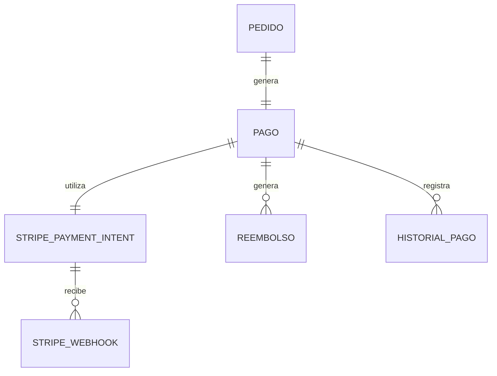

# PostgreSQL Physical Data Model

# Parte XII

# Payment Service (PAY)

> Proyecto: Alpacart ERP

---

# 1. Objetivo

El dominio Payment Service (PAY) administra todo el ciclo de vida de las transacciones económicas realizadas mediante la pasarela de pago Stripe.

Este dominio es responsable de registrar los pagos, mantener el historial de transacciones y controlar los reembolsos.

El dominio PAY NO administra pedidos.

El dominio PAY NO administra inventario.

Su única responsabilidad es la gestión de pagos.

---

# 2. Responsabilidades

PAY administra:

- Pagos
- Transacciones Stripe
- Reembolsos
- Webhooks de Stripe
- Historial de pagos

No administra:

- Productos
- Pedidos
- Clientes
- Inventario

---

# 3. Arquitectura

PAY

├── Pago
├── StripePaymentIntent
├── StripeWebhook
├── Reembolso
└── HistorialPago

---

# 4. Flujo del Dominio

Pedido

↓

Crear Payment Intent

↓

Cliente paga

↓

Stripe confirma

↓

Pago aprobado

↓

OMS actualiza Pedido

↓

Shipping inicia preparación

---

# 5. Entidades

- Pago
- StripePaymentIntent
- StripeWebhook
- Reembolso
- HistorialPago

---

# 6. Tabla Pago

Nombre físico

pago

Descripción

Representa un pago asociado a un pedido.

Campos

| Campo | Tipo |
|--------|------|
| id | UUID |
| pedido_id | UUID |
| stripe_payment_intent_id | UUID |
| estado | VARCHAR(40) |
| moneda | VARCHAR(10) |
| subtotal | NUMERIC(12,2) |
| impuestos | NUMERIC(12,2) |
| envio | NUMERIC(12,2) |
| total | NUMERIC(12,2) |
| fecha_pago | TIMESTAMPTZ NULL |
| created_at | TIMESTAMPTZ |
| updated_at | TIMESTAMPTZ |

Estados

Pendiente

Procesando

Pagado

Fallido

Cancelado

Reembolsado

---

# 7. Tabla StripePaymentIntent

Nombre físico

stripe_payment_intent

Descripción

Almacena la información devuelta por Stripe para cada intento de pago.

Campos

id

pago_id

payment_intent_id

client_secret

estado_stripe

metodo_pago

ultima_respuesta

created_at

updated_at

Restricciones

payment_intent_id UNIQUE

Observaciones

El campo client_secret solo debe almacenarse mientras sea necesario para completar el pago.

---

# 8. Tabla StripeWebhook

Nombre físico

stripe_webhook

Descripción

Registro de todos los eventos recibidos desde Stripe.

Campos

id

stripe_event_id

tipo_evento

payload_json

procesado

fecha_evento

created_at

Restricciones

stripe_event_id UNIQUE

Ejemplos

payment_intent.created

payment_intent.processing

payment_intent.succeeded

payment_intent.payment_failed

charge.refunded

---

# 9. Tabla Reembolso

Nombre físico

reembolso

Descripción

Representa un reembolso realizado mediante Stripe.

Campos

id

pago_id

stripe_refund_id

monto

motivo

estado

created_at

Estados

Pendiente

Procesando

Completado

Fallido

Cancelado

---

# 10. Tabla HistorialPago

Nombre físico

historial_pago

Descripción

Historial cronológico del pago.

Campos

id

pago_id

estado

descripcion

usuario_id

created_at

Ejemplos

Pago creado

Payment Intent generado

Pago aprobado

Pago rechazado

Reembolso solicitado

Reembolso completado

---

# 11. Relaciones

---

# 12. Índices

Pago

pedido_id

estado

fecha_pago

StripePaymentIntent

payment_intent_id

estado_stripe

StripeWebhook

stripe_event_id

tipo_evento

procesado

Reembolso

pago_id

estado

---

# 13. Reglas de Negocio

- Todo Pago pertenece exactamente a un Pedido.
- Todo Pedido puede generar únicamente un Pago.
- Todo Payment Intent pertenece a un Pago.
- Los Webhooks nunca modifican directamente el Pedido; notifican al dominio OMS.
- Un Pago puede tener múltiples registros históricos.
- Un Pago puede tener cero o más Reembolsos.
- El monto total reembolsado nunca puede superar el monto pagado.

---

# 14. Eventos

Produce

PagoCreado

PaymentIntentGenerado

PagoProcesando

PagoAprobado

PagoRechazado

WebhookRecibido

ReembolsoSolicitado

ReembolsoCompletado

HistorialPagoActualizado

---

# 15. Casos de Uso

CU-PAY-001 Crear pago

CU-PAY-002 Generar Payment Intent

CU-PAY-003 Confirmar pago

CU-PAY-004 Procesar Webhook

CU-PAY-005 Registrar historial

CU-PAY-006 Solicitar reembolso

CU-PAY-007 Consultar estado del pago

CU-PAY-008 Consultar historial

---

# 16. Validaciones

- Todo Pago debe pertenecer a un Pedido.
- payment_intent_id debe ser único.
- stripe_event_id debe ser único.
- El total debe ser mayor que cero.
- El monto reembolsado no puede exceder el total pagado.
- No procesar dos veces el mismo Webhook.

---

# 17. Dependencias

Consume

- OMS
- CFG

Produce información para

- Shipping
- Analytics
- Audit

---

# 18. Resumen del Dominio

Aggregate Root

Pago

Entidades

5

Relaciones

5

Eventos

9

Casos de Uso

8

Dependencias

2