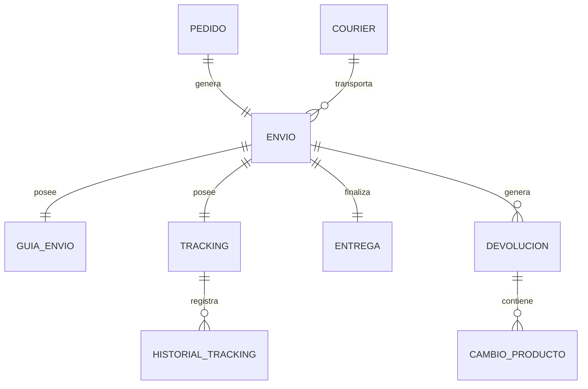

# PostgreSQL Physical Data Model

# Parte XIII

# Shipping Service (SHP)

> Proyecto: Alpacart ERP

---

# 1. Objetivo

El dominio Shipping Service (SHP) administra todo el proceso logístico asociado a un pedido, desde la preparación del paquete hasta la entrega al cliente.

Este dominio es responsable del seguimiento del envío, la gestión del courier, las devoluciones y los cambios de productos.

El dominio Shipping NO administra pagos.

El dominio Shipping NO administra inventario.

El dominio Shipping utiliza la información generada por OMS y PAY para ejecutar el despacho del pedido.

---

# 2. Responsabilidades

Shipping administra:

- Preparación del pedido
- Empaque
- Envíos
- Courier
- Guías
- Tracking
- Entregas
- Devoluciones
- Cambios

No administra:

- Productos
- Inventario
- Pagos

---

# 3. Arquitectura

SHP

├── Envio
├── GuiaEnvio
├── Courier
├── Tracking
├── HistorialTracking
├── Entrega
├── Devolucion
└── CambioProducto

---

# 4. Flujo del Dominio

Pago Confirmado

↓

Preparación

↓

Empaque

↓

Guía

↓

Courier

↓

En Tránsito

↓

Entregado

↓

Postventa

↓

Cambio / Devolución (Opcional)

---

# 5. Entidades

- Envio
- GuiaEnvio
- Courier
- Tracking
- HistorialTracking
- Entrega
- Devolucion
- CambioProducto

---

# 6. Tabla Envio

Nombre físico

envio

Descripción

Representa el proceso logístico asociado a un pedido.

Campos

| Campo | Tipo |
|--------|------|
| id | UUID |
| pedido_id | UUID |
| courier_id | UUID |
| guia_envio_id | UUID NULL |
| estado | VARCHAR(40) |
| fecha_preparacion | TIMESTAMPTZ NULL |
| fecha_despacho | TIMESTAMPTZ NULL |
| fecha_entrega_estimada | TIMESTAMPTZ NULL |
| fecha_entrega_real | TIMESTAMPTZ NULL |
| created_at | TIMESTAMPTZ |
| updated_at | TIMESTAMPTZ |

---

# 7. Tabla GuiaEnvio

Nombre físico

guia_envio

Descripción

Información de la guía generada para el envío.

Campos

id

codigo_guia

url_guia_pdf

peso

cantidad_paquetes

observaciones

created_at

Restricciones

Código de guía único.

---

# 8. Tabla Courier

Nombre físico

courier

Descripción

Empresa encargada del transporte.

Campos

id

nombre

sitio_web

telefono

correo

url_tracking

activo

created_at

Ejemplos

Olva Courier

Shalom

Delivery Local

---

# 9. Tabla Tracking

Nombre físico

tracking

Descripción

Estado actual del envío.

Campos

id

envio_id

codigo_seguimiento

estado

ubicacion_actual

ultima_actualizacion

created_at

Estados

Preparando

Despachado

En tránsito

En reparto

Entregado

Incidencia

---

# 10. Tabla HistorialTracking

Nombre físico

historial_tracking

Descripción

Registro cronológico de los cambios del seguimiento.

Campos

id

tracking_id

estado

ubicacion

descripcion

fecha_evento

created_at

Observaciones

Nunca modificar registros existentes.

Siempre agregar nuevos eventos.

---

# 11. Tabla Entrega

Nombre físico

entrega

Descripción

Información de la entrega final al cliente.

Campos

id

envio_id

recibido_por

documento_receptor

fecha_entrega

observaciones

confirmada

created_at

---

# 12. Tabla Devolucion

Nombre físico

devolucion

Descripción

Solicitud de devolución de un pedido.

Campos

id

envio_id

motivo

descripcion

estado

fecha_solicitud

fecha_resolucion

created_at

Estados

Solicitada

Aprobada

Rechazada

Recibida

Finalizada

---

# 13. Tabla CambioProducto

Nombre físico

cambio_producto

Descripción

Solicitud de cambio de productos.

Campos

id

devolucion_id

pedido_detalle_id

motivo

estado

created_at

Estados

Solicitado

Aprobado

Rechazado

Completado

---

# 14. Relaciones

---

# 15. Índices

Envio

pedido_id

estado

courier_id

Tracking

codigo_seguimiento

estado

GuiaEnvio

codigo_guia

Courier

nombre

Devolucion

estado

fecha_solicitud

CambioProducto

estado

---

# 16. Reglas de Negocio

- Todo Envío pertenece a un Pedido.
- Todo Envío utiliza un Courier.
- Todo Envío puede generar una única Guía.
- Todo Envío posee un único Tracking.
- El HistorialTracking nunca debe modificarse.
- Solo un pedido entregado puede generar una Devolución.
- Todo CambioProducto debe estar asociado a una Devolución.
- La fecha de entrega real solo puede registrarse cuando el estado sea "Entregado".

---

# 17. Eventos

Produce

EnvioCreado

PreparacionIniciada

GuiaGenerada

DespachoRealizado

TrackingActualizado

EntregaConfirmada

DevolucionSolicitada

DevolucionAprobada

CambioSolicitado

---

# 18. Casos de Uso

CU-SHP-001 Crear envío

CU-SHP-002 Asignar courier

CU-SHP-003 Generar guía

CU-SHP-004 Actualizar tracking

CU-SHP-005 Confirmar entrega

CU-SHP-006 Registrar devolución

CU-SHP-007 Procesar devolución

CU-SHP-008 Registrar cambio

CU-SHP-009 Consultar historial de seguimiento

---

# 19. Validaciones

- Todo Envío debe pertenecer a un Pedido.
- Código de guía único.
- Código de seguimiento único.
- No permitir registrar una entrega sin guía.
- No permitir devoluciones sobre pedidos no entregados.
- No permitir cambios sin devolución registrada.
- No eliminar registros históricos de tracking.

---

# 20. Dependencias

Consume

- OMS
- PAY
- CRM
- CFG

Produce información para

- Analytics
- Audit

---

# 21. Resumen del Dominio

Aggregate Root

Envio

Entidades

8

Relaciones

8

Eventos

9

Casos de Uso

9

Dependencias

4