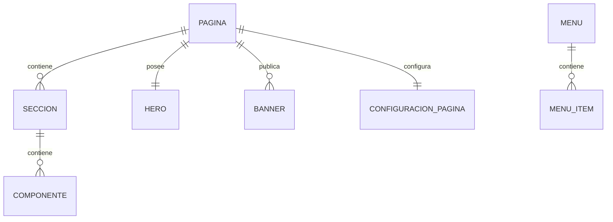

# PostgreSQL Physical Data Model

# Parte XIV

# Content Management Service (CMS)

> Proyecto: Alpacart ERP

---

# 1. Objetivo

El dominio Content Management Service (CMS) administra todo el contenido público del sitio web institucional y del e-commerce.

Este dominio permite crear, organizar y publicar contenido sin necesidad de modificar el código fuente de la aplicación.

El CMS será utilizado para administrar páginas, banners, secciones, componentes visuales y contenido informativo.

No administra productos.

No administra pedidos.

No administra promociones.

---

# 2. Responsabilidades

CMS administra:

- Páginas
- Secciones
- Componentes
- Hero
- Banners
- FAQ
- Menús
- Footer
- Contenido Institucional
- Contenido Legal

No administra:

- Productos
- Inventario
- Pagos
- Pedidos

---

# 3. Arquitectura

CMS

├── Pagina
├── Seccion
├── Componente
├── Hero
├── Banner
├── FAQ
├── Menu
├── MenuItem
├── Footer
├── ContenidoLegal
└── ConfiguracionPagina

---

# 4. Flujo del Dominio

Crear Página

↓

Agregar Secciones

↓

Agregar Componentes

↓

Configurar SEO

↓

Publicar

↓

Visible para clientes

---

# 5. Entidades

- Pagina
- Seccion
- Componente
- Hero
- Banner
- FAQ
- Menu
- MenuItem
- Footer
- ContenidoLegal
- ConfiguracionPagina

---

# 6. Tabla Pagina

Nombre físico

pagina

Descripción

Representa una página administrable del sitio.

Campos

| Campo | Tipo |
|--------|------|
| id | UUID |
| nombre | VARCHAR(150) |
| slug | VARCHAR(180) |
| titulo | VARCHAR(255) |
| descripcion | TEXT |
| estado | VARCHAR(30) |
| orden | INTEGER |
| visible | BOOLEAN |
| created_at | TIMESTAMPTZ |
| updated_at | TIMESTAMPTZ |

Estados

Borrador

Publicado

Archivado

---

# 7. Tabla Seccion

Nombre físico

seccion

Descripción

Agrupa componentes dentro de una página.

Campos

id

pagina_id

nombre

tipo

orden

visible

created_at

updated_at

Ejemplos

Hero

Nosotros

Productos Destacados

FAQ

Contacto

---

# 8. Tabla Componente

Nombre físico

componente

Descripción

Elemento reutilizable dentro de una sección.

Campos

id

seccion_id

tipo

titulo

subtitulo

contenido

asset_id

orden

visible

created_at

Ejemplos

Texto

Imagen

Video

Botón

Tarjeta

Carrusel

Galería

---

# 9. Tabla Hero

Nombre físico

hero

Descripción

Configuración del banner principal.

Campos

id

pagina_id

titulo

subtitulo

descripcion

imagen_asset_id

boton_principal

url_boton

activo

created_at

---

# 10. Tabla Banner

Nombre físico

banner

Descripción

Banners promocionales del sitio.

Campos

id

pagina_id

titulo

descripcion

imagen_asset_id

url_destino

fecha_inicio

fecha_fin

activo

created_at

---

# 11. Tabla FAQ

Nombre físico

faq

Descripción

Preguntas frecuentes.

Campos

id

pregunta

respuesta

orden

activo

created_at

---

# 12. Tabla Menu

Nombre físico

menu

Descripción

Representa un menú de navegación.

Campos

id

nombre

ubicacion

activo

created_at

Ubicaciones

Principal

Footer

Mobile

---

# 13. Tabla MenuItem

Nombre físico

menu_item

Descripción

Opciones de navegación.

Campos

id

menu_id

titulo

url

pagina_id

orden

visible

created_at

---

# 14. Tabla Footer

Nombre físico

footer

Descripción

Información mostrada en el pie de página.

Campos

id

empresa_id

descripcion

copyright

correo

telefono

direccion

created_at

updated_at

---

# 15. Tabla ContenidoLegal

Nombre físico

contenido_legal

Descripción

Contenido legal publicado.

Campos

id

tipo

titulo

contenido

version

vigente

fecha_publicacion

created_at

Tipos

Términos y Condiciones

Política de Privacidad

Política de Cookies

---

# 16. Tabla ConfiguracionPagina

Nombre físico

configuracion_pagina

Descripción

Configuración específica de una página.

Campos

id

pagina_id

meta_title

meta_description

keywords

og_image_asset_id

robots

canonical_url

created_at

---

# 17. Relaciones

---

# 18. Índices

Pagina

slug

estado

visible

Seccion

pagina_id

orden

Componente

seccion_id

orden

Banner

pagina_id

activo

fecha_inicio

fecha_fin

FAQ

orden

MenuItem

menu_id

orden

ContenidoLegal

tipo

vigente

---

# 19. Reglas de Negocio

- Toda Página posee múltiples Secciones.
- Toda Sección posee múltiples Componentes.
- Una Página puede tener un único Hero.
- Los Banners pueden programarse por fecha.
- Toda Página pública debe tener configuración SEO.
- El Menú Principal debe contener únicamente páginas publicadas.
- Solo una versión de un documento legal puede estar vigente por tipo.

---

# 20. Eventos

Produce

PaginaCreada

PaginaPublicada

PaginaArchivada

SeccionCreada

ComponenteActualizado

HeroActualizado

BannerPublicado

FAQActualizada

MenuActualizado

ContenidoLegalPublicado

---

# 21. Casos de Uso

CU-CMS-001 Crear página

CU-CMS-002 Editar página

CU-CMS-003 Publicar página

CU-CMS-004 Administrar secciones

CU-CMS-005 Administrar componentes

CU-CMS-006 Configurar Hero

CU-CMS-007 Administrar banners

CU-CMS-008 Administrar FAQ

CU-CMS-009 Administrar menú

CU-CMS-010 Publicar contenido legal

---

# 22. Validaciones

- Slug único.
- Toda página publicada debe tener título.
- Toda página publicada debe tener configuración SEO.
- Hero único por página.
- Los banners no pueden superponerse en el mismo espacio y período.
- Los documentos legales deben mantener historial de versiones.

---

# 23. Dependencias

Consume

- Storage
- CFG

Produce información para

- Frontend Web
- Marketing
- Analytics

---

# 24. Resumen del Dominio

Aggregate Root

Pagina

Entidades

11

Relaciones

6

Eventos

10

Casos de Uso

10

Dependencias

2