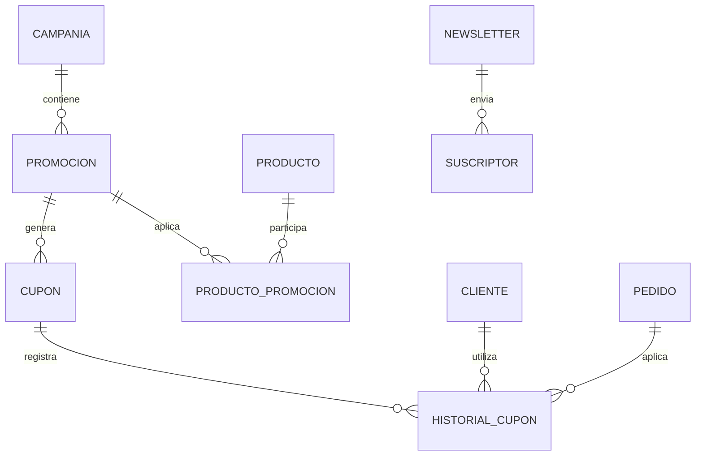

# PostgreSQL Physical Data Model

# Parte XV

# Marketing Service (MKT)

> Proyecto: Alpacart ERP

---

# 1. Objetivo

El dominio Marketing Service (MKT) administra todas las estrategias comerciales orientadas a incrementar las ventas del e-commerce.

Este dominio es responsable de campañas, promociones, cupones de descuento, newsletters y suscriptores.

El dominio Marketing no administra contenido institucional.

El contenido visual pertenece al dominio CMS.

---

# 2. Responsabilidades

Marketing administra:

- Campañas
- Promociones
- Cupones
- Newsletter
- Suscriptores
- Productos Promocionados

No administra:

- Productos
- Pedidos
- Pagos
- CMS

---

# 3. Arquitectura

MKT

├── Campaña
├── Promocion
├── Cupon
├── Newsletter
├── Suscriptor
├── ProductoPromocion
└── HistorialCupon

---

# 4. Flujo del Dominio

Crear Campaña

↓

Crear Promoción

↓

Asignar Productos

↓

Publicar

↓

Cliente utiliza Cupón

↓

OMS calcula descuento

↓

Registrar uso

↓

Analytics

---

# 5. Entidades

- Campaña
- Promoción
- Cupón
- Newsletter
- Suscriptor
- ProductoPromocion
- HistorialCupon

---

# 6. Tabla Campaña

Nombre físico

campania

Descripción

Representa una estrategia comercial.

Campos

| Campo | Tipo |
|--------|------|
| id | UUID |
| nombre | VARCHAR(180) |
| descripcion | TEXT |
| fecha_inicio | TIMESTAMPTZ |
| fecha_fin | TIMESTAMPTZ |
| estado | VARCHAR(30) |
| presupuesto | NUMERIC(12,2) NULL |
| created_at | TIMESTAMPTZ |
| updated_at | TIMESTAMPTZ |

Estados

Borrador

Programada

Activa

Finalizada

Cancelada

---

# 7. Tabla Promocion

Nombre físico

promocion

Descripción

Beneficio comercial asociado a una campaña.

Campos

id

campania_id

nombre

tipo_descuento

valor

fecha_inicio

fecha_fin

activa

created_at

Tipos

Porcentaje

Monto fijo

Envío Gratis

---

# 8. Tabla Cupon

Nombre físico

cupon

Descripción

Código utilizado por el cliente durante el checkout.

Campos

id

promocion_id

codigo

tipo_descuento

valor

uso_maximo

uso_actual

fecha_inicio

fecha_fin

activo

created_at

Restricciones

Código único.

---

# 9. Tabla Newsletter

Nombre físico

newsletter

Descripción

Campaña de correo electrónico.

Campos

id

asunto

contenido

estado

fecha_programada

fecha_envio

created_at

Estados

Borrador

Programado

Enviado

Cancelado

---

# 10. Tabla Suscriptor

Nombre físico

suscriptor

Descripción

Persona suscrita al boletín.

Campos

id

correo

cliente_id

activo

fecha_suscripcion

created_at

Restricciones

Correo único.

---

# 11. Tabla ProductoPromocion

Nombre físico

producto_promocion

Descripción

Productos asociados a una promoción.

Campos

id

promocion_id

producto_id

created_at

---

# 12. Tabla HistorialCupon

Nombre físico

historial_cupon

Descripción

Registro del uso de cupones.

Campos

id

cupon_id

pedido_id

cliente_id

descuento_aplicado

fecha_uso

created_at

---

# 13. Relaciones

---

# 14. Índices

Campania

estado

fecha_inicio

fecha_fin

Promocion

campania_id

activa

Cupon

codigo

activo

fecha_fin

Suscriptor

correo

cliente_id

HistorialCupon

cliente_id

pedido_id

---

# 15. Reglas de Negocio

- Toda Promoción pertenece a una Campaña.
- Todo Cupón pertenece a una Promoción.
- El código del Cupón debe ser único.
- Un Cupón no puede utilizarse después de su fecha de expiración.
- El número de usos no puede superar el límite definido.
- Un Cliente puede suscribirse una sola vez al Newsletter.
- El historial de uso de cupones nunca debe eliminarse.

---

# 16. Eventos

Produce

CampaniaCreada

CampaniaPublicada

PromocionCreada

CuponGenerado

CuponUtilizado

NewsletterProgramado

NewsletterEnviado

SuscriptorRegistrado

ProductoPromocionado

---

# 17. Casos de Uso

CU-MKT-001 Crear campaña

CU-MKT-002 Crear promoción

CU-MKT-003 Crear cupón

CU-MKT-004 Asociar productos

CU-MKT-005 Publicar campaña

CU-MKT-006 Programar newsletter

CU-MKT-007 Registrar suscriptor

CU-MKT-008 Consultar historial de cupones

---

# 18. Validaciones

- Código de cupón único.
- Fecha inicio menor que fecha fin.
- Valor del descuento mayor que cero.
- Uso máximo mayor que cero.
- No permitir usar cupones expirados.
- No permitir superar el límite de usos.
- Correo del suscriptor único.

---

# 19. Dependencias

Consume

- CRM
- Catalog
- OMS
- CMS

Produce información para

- Analytics

---

# 20. Resumen del Dominio

Aggregate Root

Campaña

Entidades

7

Relaciones

7

Eventos

9

Casos de Uso

8

Dependencias

4