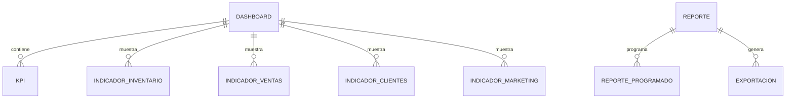

# PostgreSQL Physical Data Model

# Parte XVI

# Analytics Service (ANA)

> Proyecto: Alpacart ERP

---

# 1. Objetivo

El dominio Analytics Service (ANA) centraliza la información analítica del ERP para facilitar la toma de decisiones mediante indicadores, reportes y paneles ejecutivos.

Su función es consolidar información proveniente de los demás dominios del sistema y transformarla en métricas de negocio.

Analytics no modifica información transaccional.

Analytics únicamente consulta, procesa y presenta información.

---

# 2. Responsabilidades

Analytics administra:

- Dashboard Ejecutivo
- Indicadores (KPIs)
- Reportes
- Métricas
- Comparativos
- Exportaciones

No administra:

- Productos
- Clientes
- Pedidos
- Inventario
- Pagos

---

# 3. Arquitectura

ANA

├── Dashboard
├── KPI
├── Reporte
├── ReporteProgramado
├── Exportacion
├── IndicadorInventario
├── IndicadorVentas
├── IndicadorClientes
└── IndicadorMarketing

---

# 4. Flujo del Dominio

Datos ERP

↓

Procesamiento

↓

Indicadores

↓

Dashboard

↓

Reportes

↓

Exportación

---

# 5. Entidades

- Dashboard
- KPI
- Reporte
- ReporteProgramado
- Exportacion
- IndicadorInventario
- IndicadorVentas
- IndicadorClientes
- IndicadorMarketing

---

# 6. Tabla Dashboard

Nombre físico

dashboard

Descripción

Representa un panel configurable del sistema.

Campos

| Campo | Tipo |
|--------|------|
| id | UUID |
| nombre | VARCHAR(150) |
| descripcion | TEXT |
| modulo | VARCHAR(60) |
| activo | BOOLEAN |
| created_at | TIMESTAMPTZ |
| updated_at | TIMESTAMPTZ |

---

# 7. Tabla KPI

Nombre físico

kpi

Descripción

Indicadores principales mostrados en los dashboards.

Campos

id

dashboard_id

codigo

nombre

descripcion

valor_actual

unidad

fecha_calculo

created_at

Ejemplos

Ventas del día

Pedidos pendientes

Clientes nuevos

Productos sin stock

Ticket promedio

---

# 8. Tabla Reporte

Nombre físico

reporte

Descripción

Configuración de reportes del sistema.

Campos

id

nombre

descripcion

modulo

formato

consulta

activo

created_at

Formatos

PDF

Excel

CSV

---

# 9. Tabla ReporteProgramado

Nombre físico

reporte_programado

Descripción

Programación automática de reportes.

Campos

id

reporte_id

frecuencia

hora

correo_destino

activo

created_at

Frecuencias

Diario

Semanal

Mensual

---

# 10. Tabla Exportacion

Nombre físico

exportacion

Descripción

Historial de exportaciones realizadas.

Campos

id

usuario_id

reporte_id

formato

archivo_asset_id

fecha_exportacion

created_at

---

# 11. Tabla IndicadorInventario

Nombre físico

indicador_inventario

Descripción

Resumen de indicadores de inventario.

Campos

id

fecha

stock_total

stock_minimo

productos_sin_stock

valor_inventario

created_at

---

# 12. Tabla IndicadorVentas

Nombre físico

indicador_ventas

Descripción

Resumen comercial.

Campos

id

fecha

pedidos

ventas

ticket_promedio

productos_vendidos

created_at

---

# 13. Tabla IndicadorClientes

Nombre físico

indicador_clientes

Descripción

Indicadores relacionados con clientes.

Campos

id

fecha

clientes_nuevos

clientes_activos

clientes_recurrentes

clientes_vip

created_at

---

# 14. Tabla IndicadorMarketing

Nombre físico

indicador_marketing

Descripción

Indicadores de campañas comerciales.

Campos

id

fecha

campanias_activas

cupones_utilizados

conversion

suscriptores

created_at

---

# 15. Relaciones

---

# 16. Índices

Dashboard

nombre

modulo

KPI

dashboard_id

codigo

Reporte

modulo

activo

ReporteProgramado

reporte_id

activo

Exportacion

usuario_id

fecha_exportacion

---

# 17. Reglas de Negocio

- Todo KPI pertenece a un Dashboard.
- Todo Reporte puede programarse automáticamente.
- Toda Exportación debe registrar el usuario que la realizó.
- Los indicadores deben calcularse utilizando información consolidada de los demás dominios.
- Los dashboards no almacenan datos transaccionales.

---

# 18. Eventos

Produce

DashboardCreado

KPIActualizado

ReporteGenerado

ReporteProgramado

ExportacionRealizada

IndicadoresActualizados

---

# 19. Casos de Uso

CU-ANA-001 Consultar dashboard

CU-ANA-002 Visualizar KPIs

CU-ANA-003 Generar reporte

CU-ANA-004 Programar reporte

CU-ANA-005 Exportar información

CU-ANA-006 Consultar indicadores comerciales

CU-ANA-007 Consultar indicadores de inventario

CU-ANA-008 Consultar indicadores de marketing

---

# 20. Validaciones

- Todo KPI pertenece a un Dashboard.
- Todo Reporte debe definir un formato de salida.
- Todo Reporte Programado debe tener una frecuencia válida.
- Toda Exportación debe asociarse a un Reporte.
- No eliminar el historial de exportaciones.

---

# 21. Dependencias

Consume

- CRM
- Catalog
- Inventory
- OMS
- Payments
- Shipping
- Marketing
- CFG

Produce información para

- Dashboard ERP
- Reportes Gerenciales

---

# 22. Resumen del Dominio

Aggregate Root

Dashboard

Entidades

9

Relaciones

7

Eventos

6

Casos de Uso

8

Dependencias

8