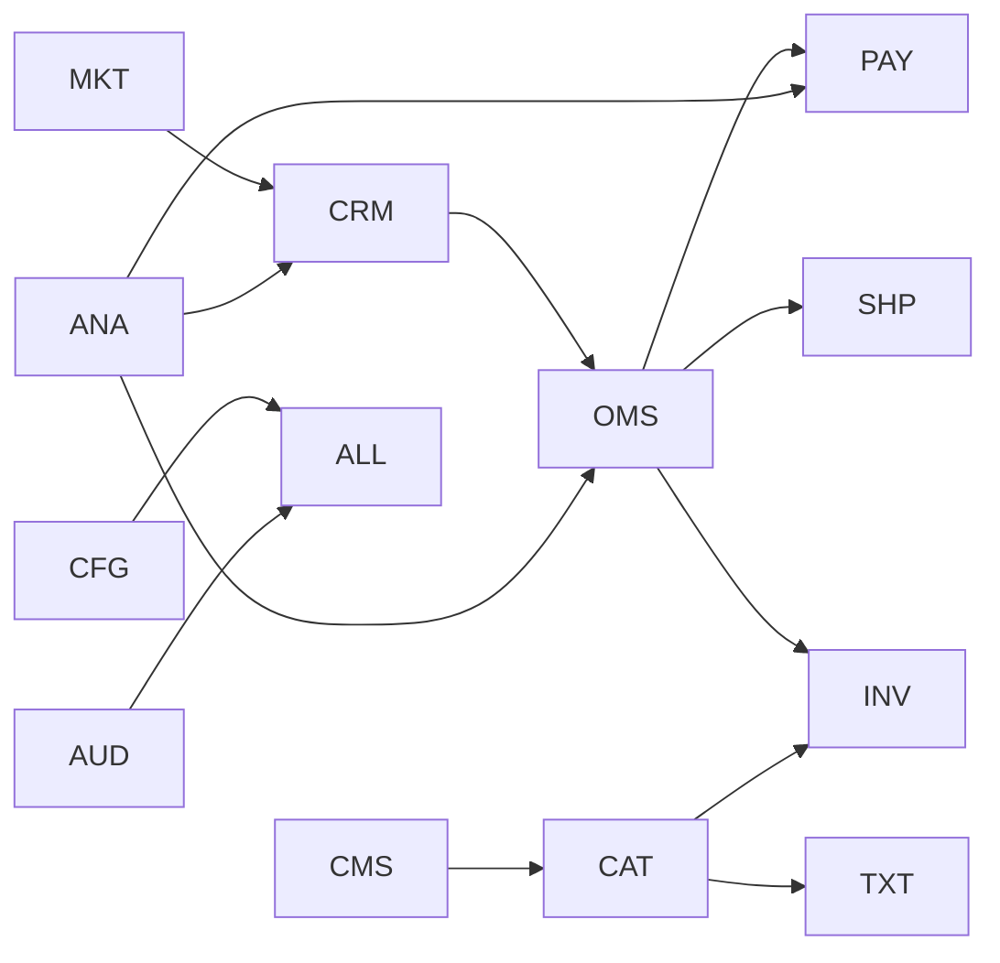

# Enterprise Domain Model (EDM)

> Proyecto: Alpacart ERP
>
> Versión: 1.0
>
> Documento de Arquitectura Empresarial

---

# 1. Objetivo

Este documento define el modelo de dominio empresarial del proyecto **Alpacart ERP**, estableciendo los dominios del negocio, sus responsabilidades, límites (Bounded Contexts), relaciones y reglas generales.

Este documento es la fuente principal para:

- Arquitectura del ERP
- Modelo de Base de Datos
- Backend Node.js
- API REST
- Dashboard
- Machine Learning futuro
- Integraciones

Este documento NO define tablas.

NO define endpoints.

NO define código.

Define el negocio.

---

# 2. Filosofía

El sistema será construido siguiendo principios de:

- Domain Driven Design (DDD)
- Clean Architecture
- SOLID
- Modular Monolith (Inicialmente)
- Microservicios (Futuro)
- API First
- Event Driven Ready

El ERP debe poder evolucionar durante los próximos años sin requerir rediseños importantes.

---

# 3. Objetivos del Negocio

Alpacart ERP permitirá administrar completamente una empresa dedicada a la comercialización de prendas de alpaca.

El sistema administrará:

- Productos
- Inventario
- Clientes
- Pedidos
- Pagos
- Envíos
- Marketing
- Sitio Web
- Reportes
- Configuración

Todo desde una única plataforma.

---

# 4. Principios de Diseño

## 4.1 Modularidad

Cada dominio será independiente.

Cada dominio tendrá:

- Entidades
- Casos de Uso
- Servicios
- Repositorios
- Eventos

Propios.

---

## 4.2 Bajo Acoplamiento

Un dominio nunca accederá directamente a la base de datos de otro dominio.

La comunicación deberá realizarse mediante:

- Casos de uso
- Eventos
- Servicios

---

## 4.3 Alta Cohesión

Cada dominio debe resolver únicamente responsabilidades relacionadas con su contexto.

---

## 4.4 Escalabilidad

Todos los dominios deberán estar preparados para:

- Machine Learning
- Integraciones
- Marketplace
- Aplicaciones móviles
- ERP Empresarial

---

# 5. Arquitectura General

```text
                          ALPACART ERP

                                  │

 ┌───────────────┬──────────────┬───────────────┬───────────────┐

 IAM            CRM            CAT             INV

 OMS            PAY            SHP             CMS

 MKT            ANA            CFG             AUD

 TXT
```

Cada bloque representa un dominio empresarial.

---

# 6. Dominios Empresariales

## IAM

Identity & Access Management

Responsable de:

- Usuarios
- Roles
- Permisos
- Autenticación
- Autorización

No administra clientes.

Solo usuarios internos.

---

## CRM

Customer Relationship Management

Responsable de:

- Clientes
- Direcciones
- Historial
- Favoritos
- Segmentación
- Soporte

---

## CAT

Catálogo

Responsable de:

- Productos
- Categorías
- Colecciones
- Variantes
- SKU
- Materiales
- Colores
- Tallas

Este dominio NO administra inventario.

---

## INV

Inventario

Responsable de:

- Stock
- Kardex
- Movimientos
- Ajustes
- Reservas
- Almacenes

Nunca administra productos.

Administra SKU.

---

## OMS

Order Management System

Responsable de:

- Carrito
- Pedidos
- Detalle Pedido
- Estados
- Timeline

---

## PAY

Payments

Responsable de:

- Stripe
- Pagos
- Reembolsos
- Métodos de Pago

No administra pedidos.

Solo transacciones.

---

## SHP

Shipping

Responsable de:

- Envíos
- Courier
- Tracking
- Guías
- Cambios
- Devoluciones

---

## CMS

Content Management System

Responsable de:

- Página Web
- Hero
- Banner
- FAQ
- Footer
- Landing
- Contenido

Todo el sitio institucional dependerá de este dominio.

---

## MKT

Marketing

Responsable de:

- Promociones
- Campañas
- Newsletter
- Cupones
- Lookbook

---

## ANA

Analytics

Responsable de:

- KPIs
- Dashboards
- Reportes
- Exportaciones

---

## CFG

Configuración

Responsable de:

- Empresa
- Parámetros
- Integraciones
- Correos
- APIs

---

## AUD

Auditoría

Responsable de:

- Logs
- Bitácoras
- Eventos
- Auditoría

Todo cambio importante deberá registrarse aquí.

---

## TXT

Dominio Textil

Dominio especializado del negocio.

Responsable de:

- Fibra
- Composición
- Procesos
- Cuidados
- Certificaciones
- Ficha Técnica

Este dominio diferencia Alpacart ERP de un ecommerce tradicional.

---

# 7. Relaciones entre Dominios



Todos los dominios reportan eventos hacia Auditoría.

---

# 8. Lenguaje Ubicuo

Todo el equipo utilizará exactamente los siguientes términos.

Producto

No representa inventario.

Representa una referencia comercial.

---

SKU

Unidad vendible.

Todo inventario pertenece al SKU.

Nunca al Producto.

---

Colección

Agrupa productos.

Ejemplo:

- Heritage
- Winter
- Premium

---

Temporada

Agrupa colecciones.

Ejemplo:

- Invierno 2026

---

Pedido

Solicitud realizada por un cliente.

---

Pago

Transacción económica asociada a un pedido.

---

Envío

Proceso logístico posterior al pago.

---

Cliente

Persona que compra productos.

Nunca iniciar sesión como Usuario.

---

Usuario

Empleado del ERP.

---

# 9. Reglas Empresariales

## Regla 1

Todo Producto debe pertenecer a una Categoría.

---

## Regla 2

Todo SKU pertenece exactamente a un Producto.

---

## Regla 3

El Stock pertenece únicamente al SKU.

---

## Regla 4

Un Pedido siempre contiene Detalles.

---

## Regla 5

Todo Pago pertenece a un Pedido.

---

## Regla 6

Todo Envío pertenece a un Pedido.

---

## Regla 7

Las Promociones nunca modifican el Producto.

Modifican el precio final.

---

## Regla 8

Todo cambio importante debe registrarse en Auditoría.

---

## Regla 9

Todo contenido institucional será administrado desde CMS.

Nunca mediante código.

---

## Regla 10

El Dominio Textil podrá crecer independientemente del Catálogo.

---

# 10. Bounded Contexts

Cada dominio será implementado como un módulo independiente.

```text
src/

domains/

iam/

crm/

catalog/

inventory/

orders/

payments/

shipping/

cms/

marketing/

analytics/

configuration/

audit/

textile/
```

No existirá código compartido entre dominios excepto mediante contratos claramente definidos.

---

# 11. Preparación para Futuras Versiones

El modelo permitirá incorporar:

- Machine Learning
- Recomendaciones Inteligentes
- ERP Multiempresa
- Marketplace
- Aplicación Móvil
- Multiidioma
- MultiMoneda
- MultiAlmacén
- BI
- Integraciones externas

Sin modificar la arquitectura principal.

---

# 12. Próximo Documento

El siguiente documento corresponde al **Enterprise Entity Relationship Diagram (EERD)**, donde se definirán todas las entidades del sistema, sus atributos principales, cardinalidades y relaciones, sirviendo como base para el diseño físico de la base de datos PostgreSQL y la implementación del backend.