# Enterprise Entity Relationship Diagram (EERD)

> Proyecto: Alpacart ERP
>
> Versión: 1.0
>
> Documento de Arquitectura Empresarial

---

# 1. Objetivo

Este documento define todas las entidades principales del ERP, sus relaciones, cardinalidades y reglas de negocio.

Este documento será utilizado para:

- Modelo PostgreSQL
- Backend Node.js
- API REST
- Dashboard ERP
- Reportes
- Integraciones
- Machine Learning

No representa todavía tablas físicas.

Representa el modelo conceptual empresarial.

---

# 2. Convenciones

Cardinalidades

1 = Uno

N = Muchos

0..1 = Opcional

0..N = Muchos opcionales

---

# 3. Agregados (DDD)

Cada dominio posee un Aggregate Root.

| Dominio | Aggregate Root |
|----------|----------------|
| IAM | Usuario |
| CRM | Cliente |
| CAT | Producto |
| INV | Stock |
| OMS | Pedido |
| PAY | Pago |
| SHP | Envío |
| CMS | Página |
| MKT | Campaña |
| ANA | Dashboard |
| CFG | Empresa |
| AUD | EventoAuditoría |
| TXT | Fibra |

---

# 4. Dominio CRM

## Aggregate Root

Cliente

---

Cliente

Gestiona toda la relación comercial.

No administra autenticación.

---

Entidades

Cliente

Dirección

Favorito

Notificación

Ticket

HistorialCliente

EtiquetaCliente

SegmentoCliente

---

## Relaciones

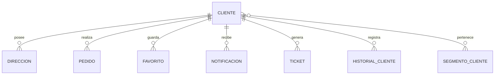

---

Reglas

Un Cliente puede tener múltiples direcciones.

Un Cliente puede realizar múltiples pedidos.

Los Favoritos pertenecen al Cliente.

El Historial nunca debe eliminarse.

---

# 5. Dominio IAM

Aggregate Root

Usuario

---

Entidades

Usuario

Rol

Permiso

Módulo

Sesión

Token

---

Relaciones

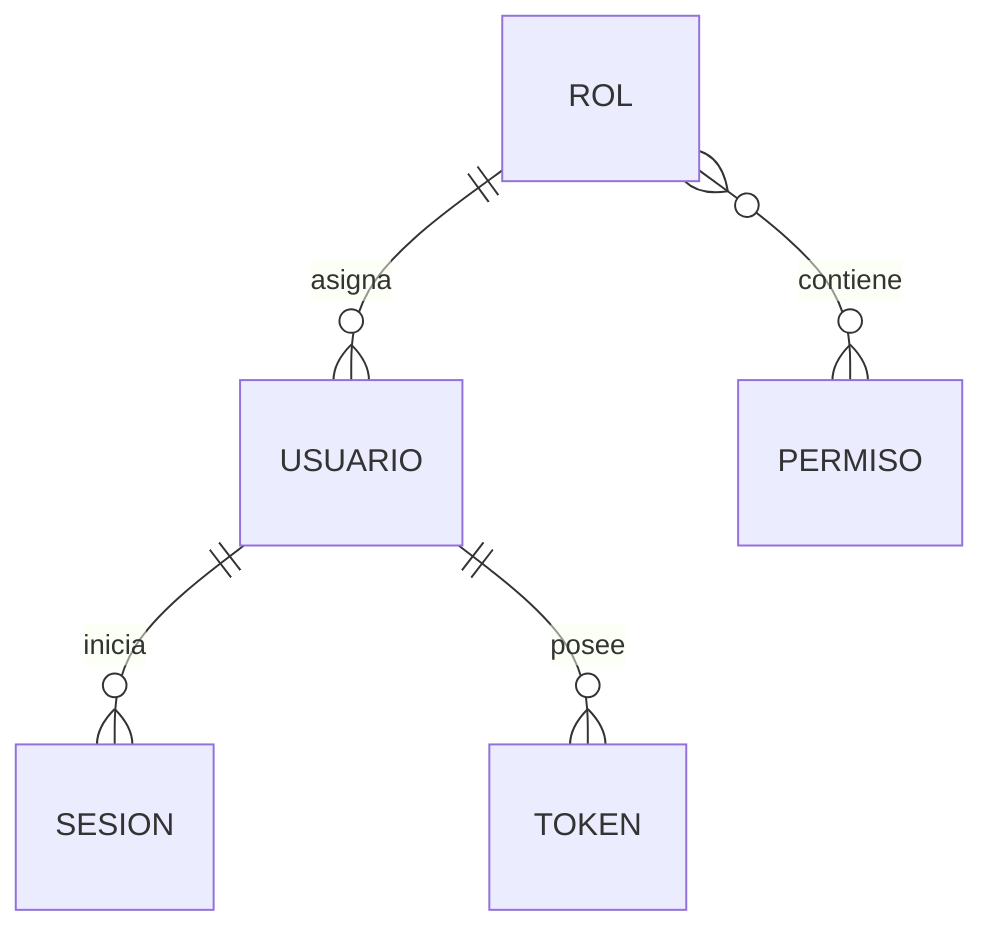

---

Reglas

Todo Usuario pertenece a un Rol.

Todo Rol posee múltiples Permisos.

---

# 6. Dominio Catálogo

Aggregate Root

Producto

---

Entidades

Producto

SKU

Variante

Categoría

Subcategoría

Colección

Temporada

Etiqueta

Galería

ImagenProducto

SEOProducto

---

Relaciones

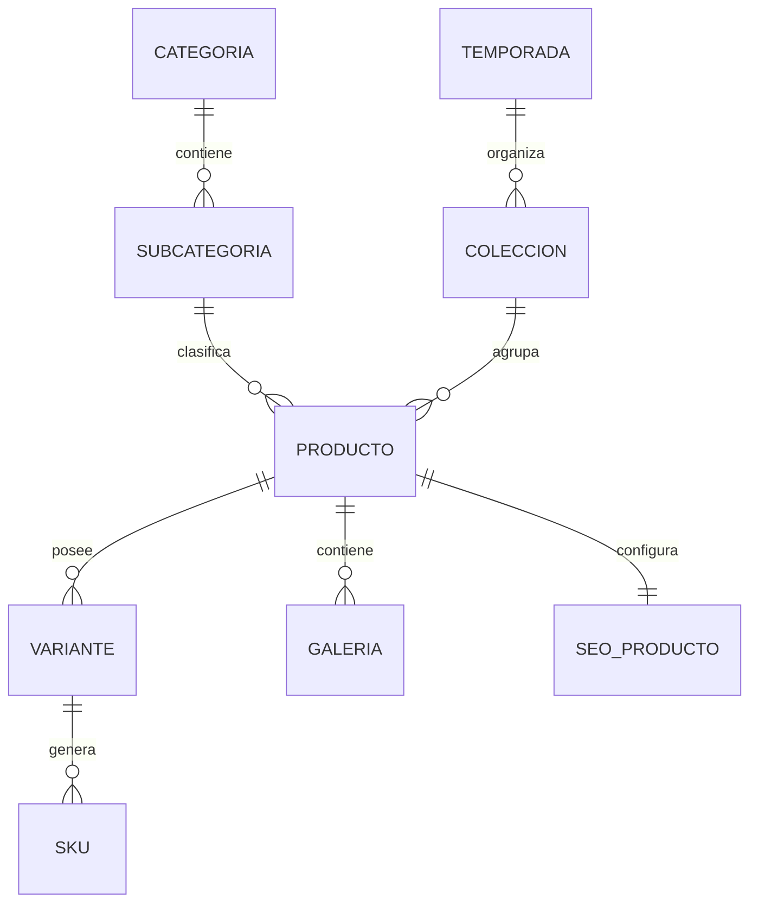

---

Reglas

Todo Producto pertenece a una Categoría.

Todo Producto puede pertenecer a una Colección.

Todo SKU pertenece exactamente a una Variante.

Todo Producto posee una Ficha SEO.

---

# 7. Dominio Textil

Aggregate Root

Fibra

---

Entidades

Fibra

Composición

Proceso

FichaTécnica

Cuidados

Certificación

Proveedor

---

Relaciones

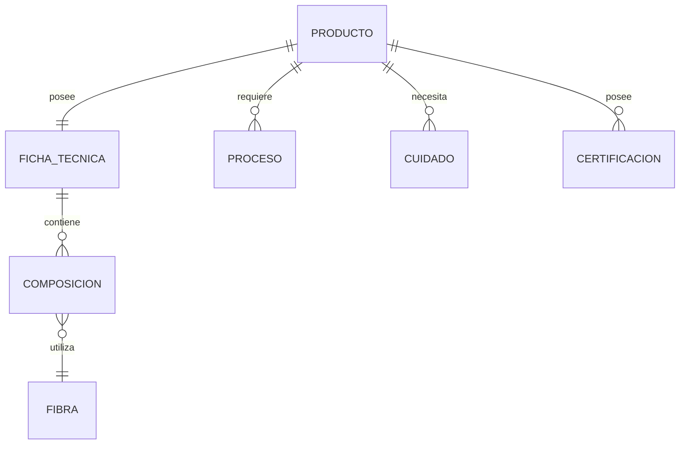

---

Reglas

Una Ficha Técnica pertenece a un Producto.

Una Composición puede utilizar varias Fibras.

Los Cuidados nunca pertenecen al SKU.

Pertenecen al Producto.

---

# 8. Dominio Inventario

Aggregate Root

Stock

---

Entidades

Stock

Movimiento

Kardex

Reserva

Almacén

Ajuste

---

Relaciones

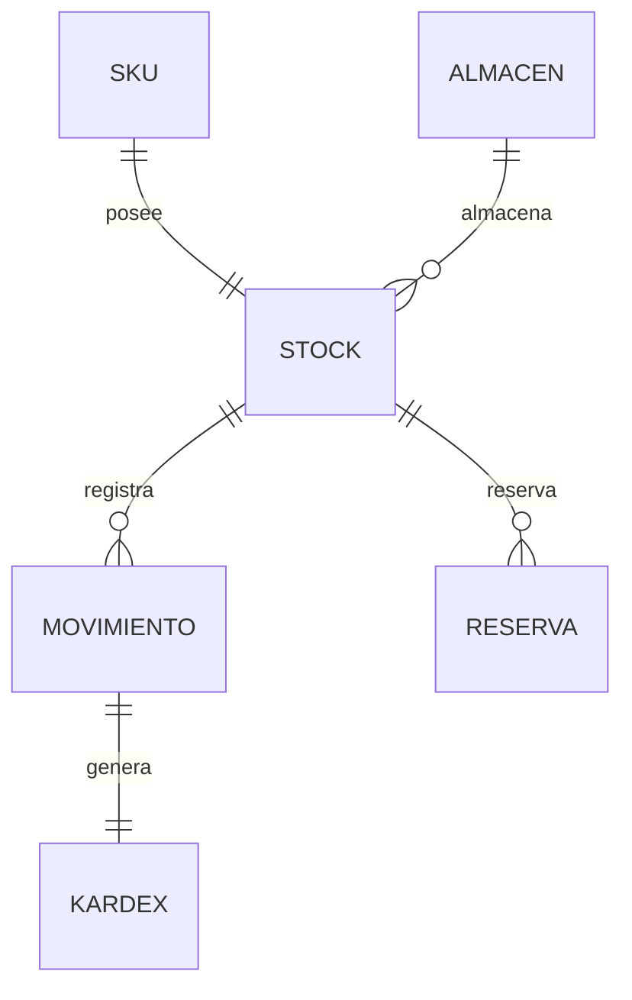

---

Reglas

Nunca existe Stock para Producto.

Todo Stock pertenece al SKU.

Todo Movimiento genera Kardex.

---

# 9. Dominio OMS

Aggregate Root

Pedido

---

Entidades

Pedido

DetallePedido

EstadoPedido

TimelinePedido

Carrito

Wishlist

---

Relaciones

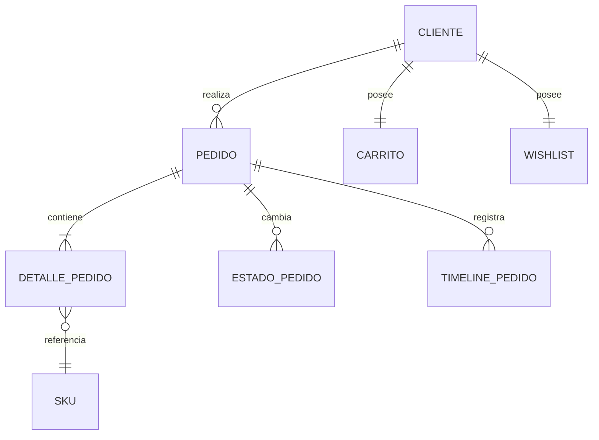

---

Reglas

Todo Pedido posee al menos un Detalle.

Todo Detalle referencia un SKU.

Nunca referencia un Producto.

---

# 10. Dominio PAY

Aggregate Root

Pago

---

Entidades

Pago

MétodoPago

StripeTransaction

Reembolso

---

Relaciones

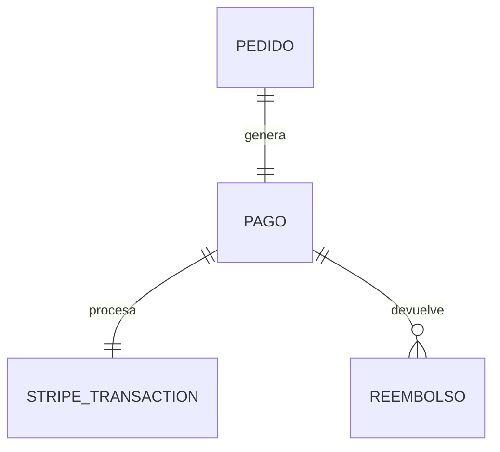

---

Reglas

Un Pedido genera un Pago.

El Pago puede tener múltiples Reembolsos.

---

# 11. Dominio Shipping

Aggregate Root

Envío

---

Entidades

Envío

Courier

Tracking

Guía

Devolución

CambioProducto

---

Relaciones

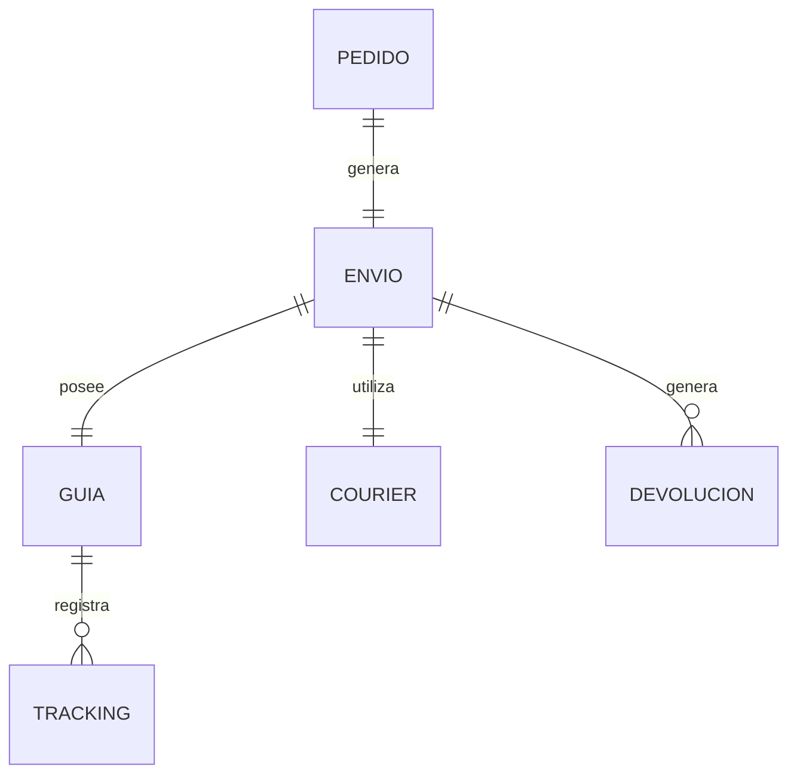

---

# 12. Dominio CMS

Aggregate Root

Página

---

Entidades

Página

Sección

Componente

Banner

Hero

FAQ

Footer

Menú

Landing

---

Relaciones

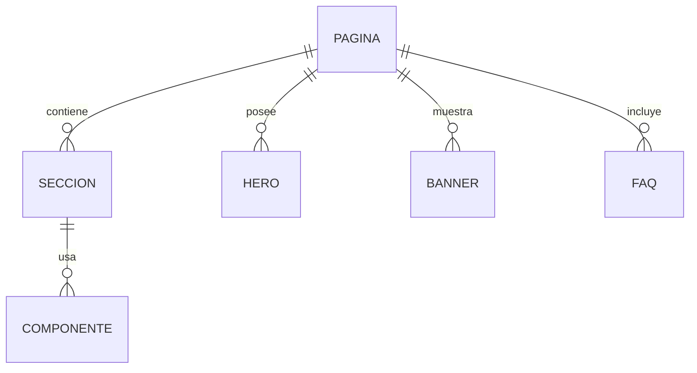

---

# 13. Dominio Marketing

Aggregate Root

Campaña

---

Entidades

Campaña

Promoción

Cupón

Newsletter

Suscriptor

Lookbook

---

Relaciones

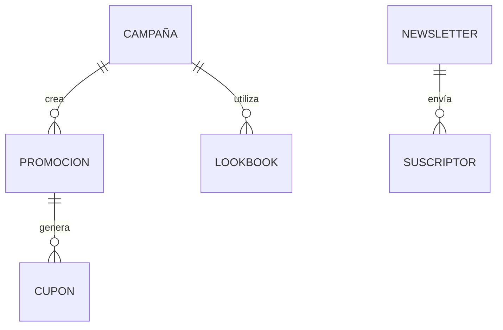

---

# 14. Relaciones Globales

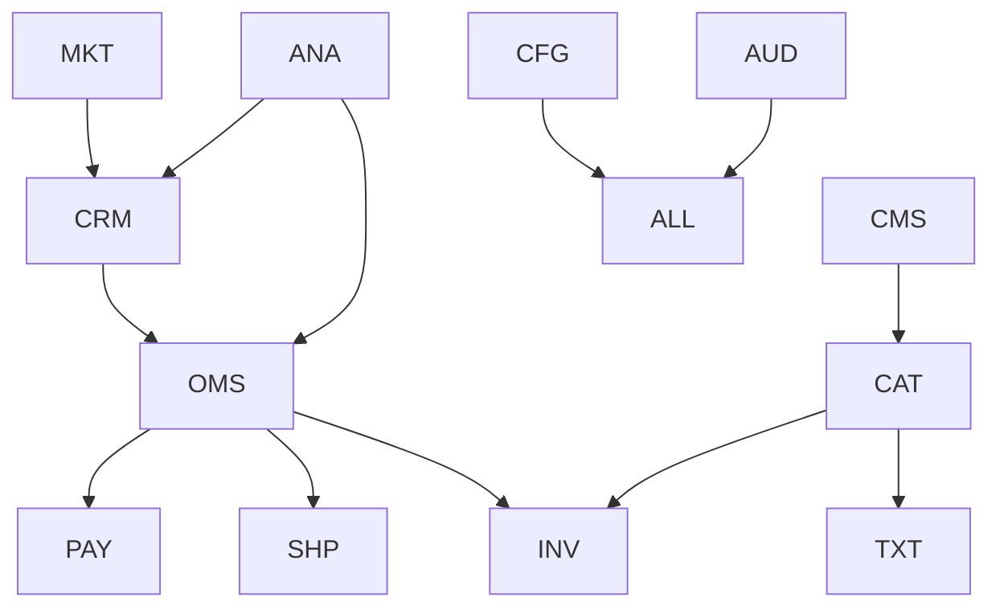

---

# 15. Próximo Documento

El siguiente volumen corresponde al **Modelo Físico PostgreSQL**, donde cada entidad será transformada en tablas, columnas, claves primarias, claves foráneas, índices, restricciones y convenciones de nombres siguiendo las mejores prácticas para PostgreSQL.