# 03 — Modelo de Datos

## Objetivo
Documentar todas las tablas de la base de datos PostgreSQL de ALPACART, sus columnas clave, foráneas y restricciones. Generar diagrama de relaciones por dominio.

## Evidencias encontradas

### Total de tablas: 57 (según migraciones 001-016)

Distribución por dominio:

### Domain IAM (7 tablas)

| Tabla | PK | FKs | Constraints CHECK | Índices |
|-------|-----|-----|-------------------|---------|
| `roles` | `id` INT | — | status IN (active,inactive); category IN (critical,operational,administrative,external) | — |
| `permissions` | `id` INT | — | — | — |
| `role_permissions` | `id` INT | role_id → roles, permission_id → permissions | UNIQUE(role_id, permission_id) | role_id |
| `departments` | `id` INT | — | — | — |
| `users` | `id` UUID | role_id → roles, department_id → departments, created_by → users (self) | status IN (active,inactive,suspended) | email, role_id, status |
| `sessions` | `id` UUID | user_id → users, customer_id → customers | actor_type IN (user,customer) | user_id, customer_id, expires_at |
| `password_resets` | `id` INT | — | actor_type IN (user,customer) | email |

### Domain Catalog (7 tablas)

| Tabla | PK | FKs | Constraints CHECK | Índices |
|-------|-----|-----|-------------------|---------|
| `categories` | `id` INT | parent_id → categories (self) | — | — |
| `collections` | `id` STR(20) | season_id → seasons | — | — |
| `tags` | `id` INT | — | — | — |
| `products` | `id` UUID | category_id → categories, collection_id → collections, created_by → users | status IN (draft,active,hidden,discontinued) | category_id, collection_id, status, (category_id,status) |
| `product_variants` | `id` UUID | product_id → products, material_id → fiber_materials, size_id → textile_sizes, color_id → textile_colors | status IN (active,hidden,out_of_stock,discontinued,coming_soon) | product_id, material_id, size_id, color_id |
| `product_media` | `id` UUID | product_id → products, variant_id → product_variants | type IN (image,video); format IN (jpg,png,mp4,webp,svg) | product_id |
| `product_tags` | `id` INT | product_id → products, tag_id → tags | UNIQUE(product_id, tag_id) | — |

### Domain Textile (4 tablas)

| Tabla | PK | FKs | Constraints CHECK | Índices |
|-------|-----|-----|-------------------|---------|
| `fiber_materials` | `id` INT | — | — | — |
| `textile_colors` | `id` INT | — | — | — |
| `textile_sizes` | `id` INT | — | — | — |
| `seasons` | `id` INT | — | — | — |

### Domain CRM (4 tablas)

| Tabla | PK | FKs | Constraints CHECK | Índices |
|-------|-----|-----|-------------------|---------|
| `clients` | `id` UUID | assigned_seller_id → users | status IN (active,inactive,vip); type IN (wholesale,retail,corporate); document_type IN (ruc,dni,passport,foreigner_card) | status, type |
| `client_addresses` | `id` INT | client_id → clients | type IN (principal,billing,shipping) | client_id |
| `client_payment_methods` | `id` INT | client_id → clients | — | — |
| `client_notes` | `id` INT | client_id → clients, user_id → users | — | — |

### Domain Customers / B2C (6 tablas)

| Tabla | PK | FKs | Constraints CHECK | Índices |
|-------|-----|-----|-------------------|---------|
| `customers` | `id` UUID | — | language IN (es,en); currency IN (PEN,USD) | email |
| `customer_addresses` | `id` INT | customer_id → customers | type IN (principal,billing,shipping) | customer_id |
| `wishlist_items` | `id` INT | customer_id → customers, product_id → products, variant_id → product_variants | — | customer_id |
| `reviews` | `id` INT | product_id → products, customer_id → customers | rating BETWEEN 1 AND 5 | product_id |
| `carts` | `id` UUID | customer_id → customers, coupon_id → coupons | — | customer_id |
| `cart_items` | `id` INT | cart_id → carts, product_id → products, variant_id → product_variants | quantity > 0 | cart_id |

### Domain Orders (4 tablas)

| Tabla | PK | FKs | Constraints CHECK | Índices |
|-------|-----|-----|-------------------|---------|
| `orders` | `id` UUID | customer_id → customers, client_id → clients, user_id → users, coupon_id → coupons | status IN (pending,confirmed,paid,preparing,shipped,in_transit,delivered,cancelled,returned) | customer_id, client_id, status, (status,created_at), placed_at |
| `order_items` | `id` INT | order_id → orders, product_id → products, variant_id → product_variants | quantity > 0 | order_id |
| `order_events` | `id` INT | order_id → orders, actor_id → users | type IN (created,confirmed,paid,preparing,shipped,transit,delivered,returned,cancelled) | order_id |
| `order_documents` | `id` INT | order_id → orders | type IN (invoice,packing_list,label,other) | order_id |

### Domain Payments (2 tablas)

| Tabla | PK | FKs | Constraints CHECK | Índices |
|-------|-----|-----|-------------------|---------|
| `transactions` | `id` UUID | order_id → orders (RESTRICT) | method IN (visa,mastercard,amex,paypal,bank_transfer,cash); status IN (pending,processing,succeeded,failed,refunded); currency IN (USD,PEN,EUR) | order_id, status, created_at |
| `transaction_refunds` | `id` INT | transaction_id → transactions | amount > 0 | transaction_id |

### Domain Inventory (5 tablas)

| Tabla | PK | FKs | Constraints CHECK | Índices |
|-------|-----|-----|-------------------|---------|
| `warehouses` | `id` INT | — | type IN (principal,secondary,production) | — |
| `stock_items` | `id` INT | product_id → products, variant_id → product_variants, warehouse_id → warehouses | quantity >= 0; reserved >= 0 AND reserved <= quantity | warehouse_id, product_id, variant_id, (warehouse_id,product_id) |
| `stock_movements` | `id` BIGINT | product_id → products, variant_id → product_variants, warehouse_id → warehouses, person_id → users | type IN (receipt,issue,transfer,adjustment,reservation) | warehouse_id, type, created_at |
| `warehouse_transfers` | `id` UUID | origin_warehouse_id → warehouses, destination_warehouse_id → warehouses, responsible_id → users | status IN (requested,authorized,in_transit,received,completed,cancelled,archived) | origin, destination |
| `warehouse_transfer_items` | `id` INT | transfer_id → warehouse_transfers, product_id → products, variant_id → product_variants | quantity > 0 | — |

### Domain Logistics (3 tablas)

| Tabla | PK | FKs | Constraints CHECK | Índices |
|-------|-----|-----|-------------------|---------|
| `carriers` | `id` INT | — | — | — |
| `shipments` | `id` UUID | order_id → orders (RESTRICT) | status IN (pending,preparing,ready,transit,delayed,delivered,returned) | order_id, status |
| `shipment_events` | `id` INT | shipment_id → shipments | — | shipment_id |

### Domain Marketing (4 tablas)

| Tabla | PK | FKs | Constraints CHECK | Índices |
|-------|-----|-----|-------------------|---------|
| `campaigns` | `id` UUID | created_by → users | status IN (draft,scheduled,active,paused,closing,finished); type IN (seasonal,promotional,recurring,professional) | status |
| `coupons` | `id` INT | campaign_id → campaigns, created_by → users | type IN (percentage,fixed) | code, active |
| `promotions` | `id` INT | campaign_id → campaigns, collection_id → collections, category_id → categories, created_by → users | type IN (percentage,fixed,bogo); applies_to IN (product,category,collection,order) | active |
| `newsletter_subscribers` | `id` INT | — | — | — |

### Domain CMS (8 tablas)

| Tabla | PK | FKs | Constraints CHECK | Índices |
|-------|-----|-----|-------------------|---------|
| `contents` | `id` UUID | author_id → users | status IN (draft,review,scheduled,published); type IN (page,blog,banner,collection,promo,faq) | status, type, slug |
| `faq_categories` | `id` INT | — | — | — |
| `faq_items` | `id` INT | category_id → faq_categories | — | category_id |
| `hero_slides` | `id` INT | — | — | — |
| `gallery_images` | `id` INT | — | — | — |
| `testimonials` | `id` INT | — | — | — |
| `benefits` | `id` INT | — | — | — |
| `artisan_processes` | `id` INT | — | — | — |

### Domain Settings / Audit / Contact (3 tablas)

| Tabla | PK | FKs | Constraints CHECK | Índices |
|-------|-----|-----|-------------------|---------|
| `company_settings` | `id` INT | — | — | — |
| `audit_logs` | `id` BIGINT | user_id → users | severity IN (success,info,warning,error,critical); action IN (create,update,delete,login) | user_id, module, created_at, severity |
| `contact_inquiries` | `id` INT | — | status IN (pending,read,replied,archived) | — |

### Tablas adicionales de infraestructura (2)

| Tabla | PK | FKs | Constraints CHECK | Propósito |
|-------|-----|-----|-------------------|-----------|
| `order_idempotency_keys` | `id` BIGINT | — | UNIQUE(customer_id, scope, idempotency_key); status IN (processing,completed,failed) | Idempotencia de checkout |
| `webhook_events` | `id` BIGINT | — | UNIQUE(provider, external_event_id); status IN (received,processing,completed,failed) | Desduplicación webhooks Stripe |

### Diagrama Mermaid (Relaciones entre dominios)

```mermaid
erDiagram
    %% IAM
    roles ||--o{ users : "role_id"
    departments ||--o{ users : "department_id"
    users ||--o{ sessions : "user_id"
    users ||--o{ password_resets : "(no FK directo)"
    users ||--o{ role_permissions : "(pivote)"
    permissions ||--o{ role_permissions : "(pivote)"

    %% Catalog
    categories ||--o{ products : "category_id"
    categories ||--o{ categories : "parent_id (self-ref)"
    collections ||--o{ products : "collection_id"
    seasons ||--o{ collections : "season_id"
    products ||--o{ product_variants : "product_id"
    products ||--o{ product_media : "product_id"
    products ||--o{ product_tags : "product_id"
    tags ||--o{ product_tags : "tag_id"
    product_variants ||--o{ product_media : "variant_id"
    fiber_materials ||--o{ product_variants : "material_id"
    textile_sizes ||--o{ product_variants : "size_id"
    textile_colors ||--o{ product_variants : "color_id"
    users ||--o{ products : "created_by"

    %% CRM
    users ||--o{ clients : "assigned_seller_id"
    clients ||--o{ client_addresses : "client_id"
    clients ||--o{ client_payment_methods : "client_id"
    clients ||--o{ client_notes : "client_id"
    users ||--o{ client_notes : "user_id"

    %% Customers >> Catalog
    customers ||--o{ customer_addresses : "customer_id"
    customers ||--o{ wishlist_items : "customer_id"
    products ||--o{ wishlist_items : "product_id"
    customers ||--o{ reviews : "customer_id"
    products ||--o{ reviews : "product_id"
    customers ||--o{ carts : "customer_id"
    carts ||--o{ cart_items : "cart_id"
    products ||--o{ cart_items : "product_id"
    product_variants ||--o{ cart_items : "variant_id"

    %% Customers >> Sessions
    customers ||--o{ sessions : "customer_id"

    %% Orders
    customers ||--o{ orders : "customer_id"
    clients ||--o{ orders : "client_id"
    users ||--o{ orders : "user_id"
    orders ||--o{ order_items : "order_id"
    orders ||--o{ order_events : "order_id"
    orders ||--o{ order_documents : "order_id"
    products ||--o{ order_items : "product_id"
    product_variants ||--o{ order_items : "variant_id"
    users ||--o{ order_events : "actor_id"

    %% Payments
    orders ||--o{ transactions : "order_id"
    transactions ||--o{ transaction_refunds : "transaction_id"

    %% Inventory
    products ||--o{ stock_items : "product_id"
    product_variants ||--o{ stock_items : "variant_id"
    warehouses ||--o{ stock_items : "warehouse_id"
    products ||--o{ stock_movements : "product_id"
    warehouses ||--o{ stock_movements : "warehouse_id"
    users ||--o{ stock_movements : "person_id"
    warehouses ||--o{ warehouse_transfers : "origin/destination"
    users ||--o{ warehouse_transfers : "responsible_id"
    warehouse_transfers ||--o{ warehouse_transfer_items : "transfer_id"

    %% Logistics
    orders ||--o{ shipments : "order_id"
    shipments ||--o{ shipment_events : "shipment_id"

    %% Marketing
    users ||--o{ campaigns : "created_by"
    campaigns ||--o{ coupons : "campaign_id"
    campaigns ||--o{ promotions : "campaign_id"
    users ||--o{ coupons : "created_by"
    users ||--o{ promotions : "created_by"
    collections ||--o{ promotions : "collection_id"
    categories ||--o{ promotions : "category_id"
    coupons ||--o{ carts : "coupon_id"
    coupons ||--o{ orders : "coupon_id"

    %% CMS
    users ||--o{ contents : "author_id"
    faq_categories ||--o{ faq_items : "category_id"

    %% Audit
    users ||--o{ audit_logs : "user_id"
```

## Hallazgos

1. **F1 — Cobertura completa de dominios**: 57 tablas cubriendo 10 dominios de negocio. El modelo de datos es maduro y cubre todos los requerimientos del sistema.

2. **F2 — Foreign Keys completas**: Las migraciones 009 y 012 agregaron ~40 FKs que conectan todos los dominios. La integridad referencial está garantizada.

3. **F3 — CHECK constraints exhaustivas**: ~40 constraints CHECK (migración 013) validan valores de status, tipo, moneda, rating, etc. La calidad de datos está asegurada a nivel BD.

4. **F4 — Índices completos**: ~50 índices (migración 014) cubren las consultas principales. Incluye índices compuestos como `(category_id, status)` y `(status, created_at)`.

5. **F5 — Infraestructura adicional**: Tablas de idempotencia y webhook dedup muestran madurez arquitectónica.

6. **F6 — Sin tablas puente redundantes**: Las relaciones many-to-many (role_permissions, product_tags) están bien modeladas con UNIQUE compuesto.

## Score: 95/100

### Criterios de puntuación
- Cobertura de dominios: 20 pts (10/10 dominios cubiertos)
- Integridad referencial (FKs): 20 pts (~50 FKs en todas las tablas relevantes)
- Validación de datos (CHECK): 20 pts (~40 constraints)
- Performance (índices): 15 pts (~50 índices con compuestos)
- Normalización: 15 pts (3NF bien aplicada, sin redundancia)
- Infraestructura adicional: 5 pts (idempotency + webhook_events)

**Deducción**: -5 pts por falta de documentación de schemas SQL generados.

**Justificación**: El modelo de datos es el componente más sólido del backend. 57 tablas bien normalizadas con FKs, CHECK constraints e índices en todos los dominios. La infraestructura adicional (idempotencia, webhooks) muestra madurez. No hay carencias significativas.
